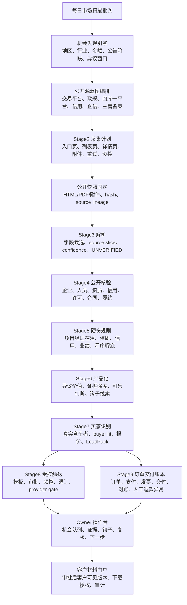

# AX9S 历史设计：自动运营与商业钩子

本文承接 `PTL-I100-143D-business-decision-architecture-and-hook-lead-roadmap-sync`。它不是 runtime 实现说明，而是 `144-149` 自主机会产品化路线的产品运行契约和历史设计依据：系统不能退化成手工选 URL 或零散 carrier，而必须自主发现可售工程异议机会。当前 `144-149` 已完成内部闭环，本文后续表述按“设计目标已落地为内部能力，仍需真实样本持续压测和受控开放治理”理解。

## 一、产品运行目标

AX9S 销售的不是软件，也不是普通招投标信息查询服务，而是公开证据驱动的工程异议线索包和证据包。

系统每天应自动回答这些问题。换句话说，系统每天自动找工程项目里的可售硬伤，并把它推进到可复核、可销售、可交付的证据包候选，而不是等待 owner 手工挑 URL。

招投标场景的默认商业入口是候选公示后证据包，而不是刚发招标公告。系统应优先从近期 07 中标候选人公示发现可售项目，再回溯 03 招标公告、04 澄清答疑、05 开标信息、06 资审结果、08 投标文件公开、09/10 中标结果；11 合同和 12 异常通常是后期或历史复盘材料，不是近期 07 项目的当前销售窗口必需项。投前预测只适用于近期 02/03/04 且投标截止/开标未过的项目；只有 02/03 且无 04 时为预澄清半成品预测，后续出现澄清、答疑、补遗或补充文件必须重新预测；一旦出现 05 开标信息，就转入开标后核验/候选后证据包路线。所有下载和解析前必须先形成 `AnalysisStrategyPlan v1`，避免把所有文件默认全量深解析。

1. 今天哪些市场和公告值得扫？
2. 哪些公开源组合最适合当前市场和规则目标？
3. 哪些项目有疑似硬伤？
4. 证据是否公开可复核？
5. 这个硬伤是否有异议价值？
6. 谁最可能买？
7. 销售前能透露到什么程度？
8. 什么必须付款、审批、交付后才能给？
9. 哪些内容必须人工复核？
10. 哪些动作必须阻断？

## 二、核心运行图

## 三、判断方式分工

| 阶段 | 判断内容 | 主要方式 | LLM 边界 |
|---|---|---|---|
| 市场扫描 | 哪些地区、工程类型、金额区间、公告阶段值得扫 | 规则 + 算力 | 不需要 |
| Source 编排 | 哪些公开源组合要跑 | 规则 | 不需要 |
| 公开采集 | URL 是否合规、是否降级、是否去重 | 规则 + 算力 | 不需要 |
| Stage3 解析 | 从公告/附件抽字段候选 | parser + LLM 辅助 | 只能辅助候选抽取 |
| Stage4 核验 | 企业/人员/信用/备案是否公开匹配 | 规则 | LLM 不得下事实结论 |
| Stage5 规则 | 是否命中硬伤 | 规则 | 只能解释草稿 |
| Stage6 产品化 | 是否值得卖、证据强弱、钩子披露等级 | 规则 + 算力 + LLM 摘要辅助 | 不得生成客户确定结论 |
| Stage7 销售 | 谁最可能买、报价、话术 | 算力 + 规则 + LLM 话术辅助 | 话术必须过白名单和禁语过滤 |
| Stage8 触达 | 能不能触达、何时触达 | 规则 + 审批 | 不得自动发送 |
| Stage9 交付 | 能不能交付、交付什么版本 | 规则 + 审计 | 不需要 |

## 四、Stage1-9 逐阶段优化评估

已有 `112-143` 不是白做，它们提供了受控入口、真实公开快照、解析、核验、规则、产品包、销售对象、触达/支付/交付 readback 和操作面基础。`144-149` 已把这些能力串成第一版“系统自主决策”的产品运行链；后续重点不是重写路线，而是按真实公开源和 SKU 继续压测、补源、补规则样本和收敛 review/block taxonomy。

| 阶段 | 当前基础 | 已落地的自主决策方向 | 判断方式 | 后续承接 |
|---|---|---|---|---|
| Stage1 任务编排 | 内部调度、任务入口、readback 已有 | 自动选择地区、工程类型、金额区间、公告阶段、异议窗口和 source blueprint batch | 规则 + 算力 | 已由 `144/145` 落地，后续按真实地区继续压测 |
| Stage2 公开采集 | 公开 URL/附件 fetcher、snapshot、hash、lineage 已有 | 根据 Stage1 计划自动决定入口页、详情页、附件、去重、重试、降级，不走手工 URL 主流程 | 规则 + 算力 | 已由 `145/149/150/151` 落地，后续补站点和附件失败样本 |
| Stage3 解析 | 真实快照进入 parser pilot 已有 | 自动选择 parser、抽字段候选、识别 source slice、冲突字段和复核原因 | parser + 算力 + LLM 候选辅助 | 已由 `146/149` 承接，后续补 08 定向解析/OCR/复杂表格 |
| Stage4 公开核验 | 企业/人员/资质/信用/许可/合同/履约 carrier 和在建冲突切片已有 | 自动决定查哪些公开核验源、如何做同名消歧、如何处理弱证据和冲突 | 规则 | 已由 `146` 承接，后续补多省地方 adapter 和释放证据源 |
| Stage5 规则证据 | catalog-aware rule factory 已有 | 自动优先跑高商业价值硬伤，输出 promote/review/block 原因并喂给 Stage6 | 规则，LLM 只写解释草稿 | 已由 `146/147` 承接，后续补 SKU 规则样本 |
| Stage6 产品化 | product package readiness 已有 | 判断线索值不值得卖，生成商业钩子、披露等级、withheld fields、leakage risk | 规则 + 算力 + LLM 摘要辅助 | 已由 `147/148` 承接，后续补人工审核和客户版差异 |
| Stage7 销售 | 真实竞争者、buyer fit、offer、LeadPack readback 已有 | 从商业钩子选择买家、报价、销售话术、禁语过滤、CRM/quote gate | 算力 + 规则 + LLM 话术辅助 | 已由 `147/148` 承接，当前不代表马上触达 |
| Stage8 触达 | approved provider execution readback 已有 | 根据钩子生成触达计划、模板、频控、退订、quiet hours 和 provider gate | 规则，LLM 只写话术草稿 | 已由 `148/149` 承接，真实发送仍需 gated |
| Stage9 交付 | 订单、支付、交付、人工退款异常 readback 已有 | 根据审批/付款/交付 gate 解锁客户版本，记录下载、对账、回滚，自动退款继续排除 | 规则 + 审计 | 已由 `148/149` 承接，真实交付仍需 gated |

结论：每个阶段都有优化空间，但优化方向不是重写，而是把已有受控能力接成自主产品决策链。LLM 只进入候选抽取、摘要、复核提示和销售话术草稿；事实判断、公开核验、规则命中、客户结论、触达发送、支付交付和退款都不能交给模型直接决定。

## 五、系统执行大脑

现在仓库里已经有一些执行零件：

- `Stage1Scheduler`：能创建内部调度任务、执行窗口、重试/暂停/恢复、Stage2 intent。
- `worker_queue`：能持久化 queue item、lease、heartbeat、retry、timeout、suspend、dead-letter、audit replay。
- Stage1-6 internal orchestration：能跑 sanitized/offline 内部链路，并把 Stage6 readback 持久化。
- operator action / workbench：能记录人工复核、审批、下一步动作和 readback。

143D 时这还不是完整“系统大脑”。后续 144-149 已把第一版 autonomous run controller、stage state machine、source blueprint、证据风险、商业钩子和真实样本 acceptance 接入内部能力。当前仍要检查的是每个真实公开源和 SKU 分支是否能稳定进入正确的 `NEXT / REVIEW / BLOCK / SUSPEND / DONE` 状态。

后续必须补的执行大脑如下：

| 组件 | 职责 | 如何推动下一步 |
|---|---|---|
| run controller | 拥有 `run_id`、stage graph、全局状态机 | 根据上一步结果创建下一阶段 queue item |
| stage state machine | 定义 Stage1-9 的 allowed states 和 transitions | 输出 `NEXT / REVIEW / BLOCK / SUSPEND / DONE` |
| decision planner | 做市场扫描、source mix、硬伤策略、商业价值、钩子披露判断 | 给下一阶段 executor 生成明确 payload |
| work queue dispatcher | lease 到期任务并调用允许的 stage executor | 成功则推进，失败则 retry/suspend/dead-letter |
| transition guard | 防止弱证据、未审批 provider、客户可见泄露继续推进 | fail closed 到 review/block/operator action |
| operator intervention gate | 需要人工复核/审批/审计时暂停 | 只有 repository-backed operator action 才能 resume |
| audit replay ledger | 记录每一步输入、输出、判断、下一步和阻断原因 | 操作台和验收能回放，不靠人工口头解释 |

历史设计要求是：144 不能只做“扫描规则”，还要建立第一版 autonomous run controller 和 stage state machine；145-149 再逐步把 source、parser、verification、rule、Stage6 钩子、Stage7 销售、Stage8 触达、Stage9 交付挂到这个控制器上。当前这些已经作为内部能力完成，后续不应回到“手工 URL 工具”路线。

每一步靠什么推动：

1. 定时/手动启动 run controller，生成 market scan batch。
2. Stage1 decision planner 选择值得分析的机会，写入 queue。
3. worker dispatcher lease 任务，调用对应 stage executor。
4. stage executor 写入 repository-backed result。
5. transition guard 读取 result，决定 `NEXT / REVIEW / BLOCK / SUSPEND / DONE`。
6. 如果是 `NEXT`，创建下一阶段 queue item。
7. 如果是 `REVIEW`，创建 operator action，操作台显示需要人工处理。
8. 如果是 `BLOCK/SUSPEND`，停止推进并记录原因。
9. 所有动作进入 audit replay ledger，供验收和回放。

这个大脑不能依赖 Codex 或人手工挑每个 URL，也不能让 LLM 直接决定事实、核验、触达、支付、交付或退款。

## 六、商业钩子线索

Stage6/Stage7 必须增加一个产品层概念：商业钩子线索。它不是完整证据包，而是销售前给客户感知价值的受控摘要。

核心原则：

> 卖前给价值感，不给可复现路径；付款或审批后，才给完整证据链。

### 6.1 三个版本

| 版本 | 使用者 | 内容范围 |
|---|---|---|
| 内部完整版 | owner / 复核人 | 完整项目、第一名、硬伤、URL、快照、核验、规则命中、风险 |
| 销售钩子版 | 销售触达 | 地区、项目类型、金额区间、公告阶段、硬伤大类、证据强度、紧迫性 |
| 客户交付版 | 付款/审批后客户 | 完整公开证据链、来源、hash、核验说明、交付版本、风险说明 |

### 6.2 销售前禁止泄露

销售钩子不得泄露：

- 具体 source URL
- 完整项目经理姓名 + 注册编号组合
- 完整冲突项目名称
- 完整时间重叠区间
- 原始快照或附件
- 完整核验路径
- 内部评分模型
- 买家排序逻辑
- 未复核推断

### 6.3 销售前可以表达

销售钩子可以表达：

- 某地区、某工程类型、某金额区间
- 某公告阶段仍有时间窗口
- 第一候选人存在某类公开可查风险
- 证据强度为高/中/需复核
- 你方作为落选或竞争方可能有直接利益
- 完整证据包需确认购买或审批后交付

### 6.4 披露等级

| 等级 | 用途 | 可说 | 不可说 |
|---|---|---|---|
| L0 内部 | 内部复核 | 全量证据 | 不外发 |
| L1 钩子 | 初次触达 | 大类、价值、紧迫性 | 不给可复现证据链 |
| L2 意向 | 深度沟通 | 部分脱敏摘要、风险说明 | 不给完整路径和原件 |
| L3 交付 | 付款/审批后 | 客户可见证据包 | 仍不暴露内部黑箱 |

## 七、高维剩余缺口评估

从产品能自主运营的标准看，剩余缺口不是“再补几个字段”，而是下面七类：

| 维度 | 当前状态 | 如果不补会怎样 | 后续承接 |
|---|---|---|---|
| 执行大脑 | 已有 scheduler / queue / orchestration / operator action 和第一版 autonomous run controller | 后续风险是个别来源/分支退回人工判断 | 已由 `144` 落地，继续按真实样本压测 |
| 市场与公开源策略 | 已有真实公开 fetcher、样本验证和 source blueprint | 后续风险是新地区仍需要 source profile/adapter 补齐 | 已由 `144/145` 落地，继续补省市覆盖 |
| 公开网抓取升级 | 已有公开站点 fetcher、source health、degrade taxonomy、失败诊断和升级闭环 | 真实站点结构变化仍会产生新 taxonomy | 已由 `150` 落地，继续收集失败样本 |
| 验证码自动化续跑 | 已有 challenge / 登录态 / source policy fail-closed 和续跑路径 | 真实第三方生产站点仍需目标授权和审计 | 已由 `151` 落地，继续按授权目标验证 |
| 证据质量与解析核验 | 有真实快照、parser、verification pilot 和 hard-defect strategy | 弱证据、同名、缺 source slice 仍可能产生 review 噪音 | 已由 `146/149` 承接，继续补 SKU 样本 |
| 商业价值与钩子转化 | 有 Stage6 package、Stage7 buyer fit/readback 和商业钩子 | 当前不等于马上销售，仍需人工审核和禁语控制 | 已由 `147` 落地，继续人工复核 |
| owner 可操作性 | 有操作台入口、readback 和产品化 workbench | 复杂缺口仍需更清晰的 next action | 已由 `148` 落地，继续 UI/工作台细化 |
| 外部执行与客户交付 | provider、支付、交付、下载都已 gated/readback | 真实外部动作仍受控，不自动放行 | 已由 `148/149` 承接，继续 sandbox/live pilot gate |
| 真实样本验收 | 已有真实公开样本 acceptance | 仍需更多地区、更多附件和更多失败场景 | 已由 `149` 落地，继续扩样本 |

判断一件事是否真的补齐，不能只看测试绿，要问：

1. 系统能不能自己决定下一步？
2. owner 是否不用 raw API 也能看懂和操作？
3. 弱证据是否会自动 review/block？
4. 销售钩子是否能引流但不泄露完整证据路径？
5. 真实公开样本能否从市场扫描跑到可售钩子和交付候选？
6. 所有 provider、触达、支付、交付、下载是否仍走审批、审计、operator action 和 replay？

## 八、已实施路线和后续使用方式

1. `PTL-I100-144-market-scan-opportunity-discovery-engine`
   已做第一版执行大脑和机会发现：run controller、stage state machine、market scan decision planner，系统自动判断哪些公告值得分析。

2. `PTL-I100-145-source-blueprint-orchestration-and-capture-plan`
   已做公开源蓝图编排：系统自动选择公开源组合并生成 Stage2 采集计划。全国聚合平台只作为一级发现、去重和补充查询面，不按全量实时源验收。

3. `PTL-I100-150-public-web-adaptive-capture-hardening-and-failure-escalation`
   已做公开网抓取失败自动升级：系统先诊断 DOM/结构改版、JS 壳、分页/跳转、附件发现、编码、超时、限频、解析模板漂移和站点健康退化，再自动选择合法采集/解析升级策略，不把纯人工重跑作为默认失败路径。

4. `PTL-I100-151-public-web-captcha-automated-resolution-and-resume`
   已做验证码自动化续跑：公开站出现验证码/校验页时，系统保留 URL、cookie、表单、任务上下文和 capture plan，优先通过自动化识别/OCR/session 续跑从同一任务恢复。

5. `PTL-I100-146-evidence-risk-and-hard-defect-verification-strategy`
   已做硬伤核验策略：系统自动决定查项目经理在建、资质、信用、业绩、许可、合同、履约等。

6. `PTL-I100-147-commercial-value-buyer-fit-and-hook-lead-engine`
   已做商业价值、买家识别和商业钩子：系统判断能不能卖、卖给谁、怎么不泄露地引流。

7. `PTL-I100-148-productized-autonomous-operator-workbench`
   已做产品化操作台：展示机会队列、证据强度、买家排序、钩子话术、复核项、下一步动作。

8. `PTL-I100-149-real-sample-autonomous-opportunity-acceptance`
   已用真实公开样本验收：从市场扫描到可售钩子和交付候选，证明系统不是手工 URL 工具。

后续使用方式：不要重复把 144-149 当成待做路线；应在这条能力链上选择一个真实来源、一个 SKU 或一个失败 taxonomy 做小闭环压测和修复。

## 九、受控开放要求

仍保持：

- 不把 LLM 输出当事实或法律结论
- 不把未复核推断直接给客户
- 不自动外发法律文书
- 不自动投诉举报
- 不无审批触达、支付或交付
- 不实现自动退款程序
