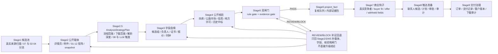

# AX9S Stage1-9 执行矩阵与子漏斗

**版本**: 2026-05-16 v2

**定位**
- 本文件是 `docs/AX9S_产品主图与验收总则.md` 的 L2/L3 操作级矩阵。
- 本文件用于逐阶段验证、验收和修复，不用于替代 `docs/L0.md`、D2-D14、`handoff/stage_handoff_catalog.json`、`control/product_runtime_architecture_map.yaml`。
- 后续修复必须按本矩阵逐条落地；如果矩阵与真实页面、代码、法规边界冲突，先修正矩阵，再修代码。
- 当前开发不是马上对外销售证据包，而是用这些证据包 SKU 反推 Stage1-9 必须具备的系统能力；每个能力都要经过真实公开源、真实项目、真实附件、真实失败 taxonomy 和可回放产物验证。

## 0. 可信等级和实现状态

### 0.1 可信等级

| 等级 | 含义 | 能否直接作为代码硬规则 |
| --- | --- | --- |
| `AUTHORITY` | L0/D 文档、handoff、contract 明确要求 | 可以 |
| `CODE_CONFIRMED` | 当前代码已存在对应入口或逻辑 | 可以，但要验证行为 |
| `REPO_RECORDED_PAGE_OBSERVATION` | 仓库资产记录过浏览器/运行时观察 | 只能作为已有观察，需复测 |
| `USER_FIELD_EXPERIENCE` | owner 实战经验 | 不能直接写死，先转成待验证规则 |
| `PRODUCT_HYPOTHESIS` | 产品上合理但未被真实页面/代码证明 | 不能直接写死 |
| `TO_VERIFY` | 待真实页面、样本或代码验证 | 不能作为 PASS 条件 |

### 0.2 实现状态

| 状态 | 含义 |
| --- | --- |
| `IMPLEMENTED` | 当前代码已实现并有测试或运行读回 |
| `PARTIAL` | 有基础对象/入口，但链路不完整 |
| `MISSING` | 未实现 |
| `NEEDS_REAL_PAGE_VERIFY` | 需要用真实页面验证搜索、翻页、字段和失败形态 |
| `NEEDS_TEST` | 需要补测试 |

### 0.3 SKU 到 Stage1-9 能力验收映射

| SKU / 能力靶 | Stage1 | Stage2 | Stage3 | Stage4 | Stage5 | Stage6 | Stage7-9 |
| --- | --- | --- | --- | --- | --- | --- | --- |
| 负责人未释放/履约冲突包 | 近期 `07` 入池，识别工程 lane、候选组和异议窗口 | 当前项目固定 `07/03/04` 和必要流程；历史在建线索先用 `data.ggzy`、`bid_show` 和原文地址做定向回溯，不全量下载 01-12，08 先登记 | 抽当前候选公司、联合体、负责人、证书、工期、报价、排名；历史项目只抽负责人、公司/联合体、工期/服务期、合同履行期限、中标日期和释放证据线索 | 四库/JZSC、全国公路建设市场监督管理系统、data.ggzy 历史中标、原文 readback、地方许可/合同/竣工/变更 | 时间窗口重叠、释放证据缺口、身份消歧和证据足够性双门；只有同一负责人/公司/联合体成员 + 时间窗口疑似重叠才触发释放证据深查 | 内部未释放风险线索包、宽筛记录、补查清单、证据强度 | 仅在能力成熟后用于买家适配、触达和交付治理 |
| 证书/注册单位/时间异常包 | 识别施工、监理、设计、勘察等不同负责人角色 | 固定候选公示和必要附件，08 默认 register-only | 负责人姓名、证书号、注册类别/专业、注册单位、有效期字段血缘 | 公司优先补证、姓名枚举兜底、职称/路桥设计证书补充查询 | 注册单位不一致、证书时间不覆盖关键节点、证书类别/专业不符 | 注册信息不一致线索和需复核字段 | 首单仍人工审核，不自动外发 |
| 信用处罚/监管风险包 | 识别企业主体、招标文件时间线和资格条件 | 固定招标文件、澄清、候选公告、处罚源 readback | 抽资格要求、处罚限制条款、企业名、统一信用代码 | 信用中国/信用广东/地方住建处罚/监管投诉/双公示 | 处罚时间、主体、资格条款和公告时间线是否疑似重合 | 信用处罚与招标要求冲突线索 | 进入综合证据包候选 |
| 综合质疑证据包 | 选择存在异议窗口和竞争主体的项目 | 03/04/07 默认重点下载，08 触发后定向解析 | 解析资格、评分、社保、业绩、响应、否决和候选表 | 企业、人员、资质、业绩、信用、许可多源核验 | 程序/资格/响应/证据双门 | 内部综合质疑报告和补证任务 | 后续才进入律师顾问/落标人承接 |
| 投前萝卜标/限制竞争预测包 | 只从未开标的 02/03/04 进入，判断 168h/72h 时间窗 | 固定招标文件、公告、澄清/补遗版本链 | 解析资格、评分、参数、合同、废标条件 | 必要时查企业/资质/历史供应商背景，但不做候选人核查 | 输出投前风险指数、限制竞争线索、澄清建议 | 投前预测报告候选，不形成候选后事实 | 不进入候选后销售对象，出现 05 后转后验路线 |

**验收硬规则**
- SKU 命中不是完成；只有对应 Stage1-6 证据链可回放，Stage7-9 受控边界明确，才算产品能力闭环。
- 没有真实样本、真实附件、失败 taxonomy 和 readback 的能力只能标为 `PARTIAL` 或 `NEEDS_REAL_PAGE_VERIFY`。
- `未命中`、`源阻断`、`字段缺失`、`08 未定向解析`、`释放证据缺失` 都不能写成排除结论。
- 业务证据专题与 `LeadPack 商业封装档位 A/B/C` 必须分离：前者决定 Stage1-6 证据路线，后者只决定 Stage7 后的商业封装、交付形态和报价带。
- 负责人未释放/履约冲突包必须先做宽筛再做深查；负责人未释放/履约重叠宽筛原文回溯只定位含负责人、工期/服务期、合同履行期限、中标日期或释放证据的阶段，不默认全量下载 01-12，也不默认解析 `08`。
- 程序时间线/公示流程缺陷包、竞争格局/陪标围标线索包先作为辅助能力方向，不进入首批主 SKU；社保造假不单独作为首批 SKU，只作为综合质疑包下的 `08` 定向解析和人工复核信号。
- 当前真实压测顺序为：证书/注册单位/时间异常包 -> 负责人未释放/履约冲突宽筛 -> 信用处罚/监管风险包 -> 综合质疑证据包 -> 投前预测包；负责人未释放深查只有在宽筛命中同人/同主体/时间窗口疑似重叠后触发。

## 1. Stage1 市场扫描与来源蓝图

| 分支 | 具体动作 | 关键字段/对象 | PASS | REVIEW/BLOCK | 当前状态 | 可信等级 | 代码入口 |
| --- | --- | --- | --- | --- | --- | --- | --- |
| 输入归一 | 地区多选、项目类型多选、金额区间、关键词、时间窗口归一 | `region_codes`, `project_types`, `amount_min/max`, `now` | 支持多地区多类型批量运行 | 输入缺失进入默认或 review，不得静默造样本 | `IMPLEMENTED` | `CODE_CONFIRMED` | `operator_customer_access.py::run_operator_autonomous_opportunity_search` |
| 广东跑通验收上限 | 广东 Stage1-6 跑通阶段默认最多取 30 条真实候选、最多读取广东公开 API 第 1 页 50 条原始记录，并在验收账本记录是否截断 | `stage1_6_validation_caps`, `candidate_limit_source`, `candidate_limit_truncated_count` | 30 条有效候选 / 1 页 50 条原始记录只是验收运行上限，不代表源头只有 30 条；必须记录上限来源、截断数量和页数 | 隐藏截断、把上限当业务过滤、只挑少量好跑样本均不得通过 | `IMPLEMENTED` | `USER_FIELD_EXPERIENCE + CODE_CONFIRMED` | `real_candidate_discovery.py`, `operator_customer_access.py` |
| 来源蓝图 | 按地区/类型/金额选择省级平台、全国聚合、核验源、信用源、地方住建源 | source blueprint, capture plan | 明确为什么选或跳过每个来源 | 全国聚合不得被当成全量实时源 | `PARTIAL` | `AUTHORITY` | `stage1_tasking/source_blueprint.py` |
| 真实候选发现 | 从真实公开列表页/API 获取候选 | `notice_candidates`, source URL, profile id | 候选可链接、可审计、有来源 profile；金额、项目类型、发布时间只打复核标签，不在发现阶段源头删除 | 无候选返回 `NO_CANDIDATES`，不得合成机会；导航、模板、废标/终止等明确无效链接可剔除 | `PARTIAL` | `CODE_CONFIRMED` | `RealPublicCandidateDiscoveryService` |
| 工程业务类型分流 | 对施工/EPC、监理、设计、勘察、勘察设计、设备材料、服务采购分别打 lane，不在源头把非施工项目硬过滤 | `engineering_work_lane`, `engineering_role_route` | 类型只决定后续核验链和优先级；勘察/设计/监理仍可进入候选池和字段统计 | 把所有公告都套项目经理/建造师规则，或因为没有项目经理就源头丢弃，不得通过 | `IMPLEMENTED` | `CODE_CONFIRMED + USER_FIELD_EXPERIENCE` | `real_candidate_capture.py` |
| A/B/C/D 验收分级 | 在 lane 之后显式打核验优先级：A 施工/EPC、B 监理、C 设计/勘察/勘察设计、D 设备材料/服务采购；按分级决定预期负责人字段和核验链 | `opportunity_priority_class`, `verification_priority_band`, `verification_focus`, `expected_responsible_role_field`, `responsible_role_gap_code` | A 缺项目经理/项目负责人、B 缺总监、C 缺设计/勘察负责人时进入企业优先身份补全；D 不因缺项目经理失败，改走供应商资格/业绩/价格/信用链 | 把 D 类缺项目经理算失败，或把 A/B/C 的角色缺失静默当通过，不得通过 | `IMPLEMENTED` | `CODE_CONFIRMED + USER_FIELD_EXPERIENCE` | `real_candidate_capture.py`, `operator_customer_access.py` |
| 候选批量分流 | 对所有候选按中标候选公示/异议窗口做第一层分流，并保留地区、类型、金额、公告阶段和字段完整度评分 | selected/skipped/review candidates | 中标候选公示/异议窗口层通过者批量入后续链路；金额、项目类型、竞争者和字段缺失只作为复核/优先级标签；真实公开候选不得因此在源头丢弃 | 不能固定挑 1 个迎合结果；只有明确非项目公告、重复、废标/终止、窗口明确过期才可不进闭环 | `PARTIAL` | `CODE_CONFIRMED` | `Stage1MarketScanEngine` |
| 试点地区覆盖 | SC/JS/ZJ/SD/GD/HB 本地 profile 分别运行 | region adapter, profile id | 每省显示真实实现状态 | SD/HB 不得显示为与 GD/JS/ZJ/SC 同等可跑 | `PARTIAL` | `CODE_CONFIRMED` | `region_adapters.py` |
| 运行持久化 | 保存搜索条件、候选、选择、失败原因 | search run record | 刷新后可读回 | 页面内存丢失不得作为正式记录 | `PARTIAL` | `CODE_CONFIRMED` | `OperatorActionRepository` |

**Stage1 下一步修复优先级**
- 补 SD/HB 候选发现器。
- 对每个地区运行返回结构做真实样本测试。
- 搜索结果状态拆成候选已进料、需复核、受限可售、正式可售、客户交付就绪。

## 2. Stage2 公开采集、快照和时钟版本

| 分支 | 具体动作 | 关键字段/对象 | PASS | REVIEW/BLOCK | 当前状态 | 可信等级 | 代码入口 |
| --- | --- | --- | --- | --- | --- | --- | --- |
| 列表入口抓取 | 访问省级列表页或公开接口，保存入口快照/运行记录 | entry snapshot, source profile | 入口公开可访问，可回放 | SPA 壳、验证码、412/521、限流进入 fail-closed/readback | `PARTIAL` | `CODE_CONFIRMED` | `real_public_url_fetcher.py` |
| 详情页抓取 | 对候选详情 URL 抓取 HTML/API detail | detail snapshot id | 详情快照与候选一一对应 | 详情无法抓取不得伪造成已解析正文 | `PARTIAL` | `CODE_CONFIRMED` | `RealCandidateStage2CaptureService` |
| 附件抓取 | 发现并抓取 PDF/DOC/XLS/ZIP 等公告附件 | attachment snapshot ids | 附件原文可回放、有 hash/来源 | 附件缺失进入 review，不得用截图替代 | `PARTIAL` | `CODE_CONFIRMED` | `fetch_attachment_original_link` |
| PDF 附件文本入 Stage3 | 对可抽取文本的 PDF 附件执行 Stage3 解析，并把附件文本合并回候选详情字段抽取；`PDF_TEXT_EMPTY` 进入 OCR fallback，OCR 引擎不可用时必须显式计入 `OCR_REQUIRED` | `attachment_snapshot_ids`, `PDF`, `project_manager_name`, `project_manager_public_identifier_optional`, `attachment_text_parse_states`, `attachment_ocr_required_count` | PDF 有可抽取文本时产出字段血缘；详情页缺项目负责人时可由附件补齐；OCR 成功字段保持 review；扫描件不得被静默当作无负责人 | PDF 无文本/损坏/扫描件进入 review/OCR_REQUIRED，不得伪造字段；项目编号/招标编号不得当证书号；本机缺 OCR 引擎时不得声明已完成扫描件识别 | `PARTIAL` | `CODE_CONFIRMED` | `stage3_parsing/ocr_text.py`, `stage3_parsing/real_parser.py`, `stage2_ingestion/real_candidate_capture.py` |
| 时钟链 | 区分公告发布日期、发布时间、投标截止、异议截止、质疑截止、开标时间 | `clock_chain_profile`, deadline fields | 每个时间字段有标签来源和优先级 | 无明确截止标签只能 unknown/review | `PARTIAL` | `AUTHORITY` | `real_candidate_capture.py` |
| 版本链 | 识别变更、补遗、澄清、中标候选、中标结果、合同公告 | `notice_version_chain` | 有版本优先级和当前有效版本 | 版本冲突进入 review | `PARTIAL` | `AUTHORITY` | `Stage2Service` |
| challenge 处理 | 登录/验证码/风控/限流/SPA 壳分类 | challenge state | 自动化能力可作为目标；真实三方执行需授权和审计 | 不得把 challenge 当成功 | `PARTIAL` | `AUTHORITY` | `real_public_url_fetcher.py` |

**Stage2 严禁**
- 把公告发布日期或项目编号片段当异议截止。
- 把 SPA 壳、截图、OCR 摘要当正式原始载体。
- 抓不到附件时生成“附件已核验”结论。

### 2.1 Stage1-2 authority 字段与状态机落点

本表吸收 `专题_Stage1-2_来源覆盖与采集路由` 的高价值 authority 字段，目的是让 Stage1-2 的正式落点在 L2 一眼可见，而不必先翻专题文档。

| 维度 | 关键字段/概念 | 当前正式作用 | 主要落点 |
| --- | --- | --- | --- |
| 来源 authority | `source_family`, `platform_level`, `carrier_type` | 说明候选、详情、附件和核验 carrier 来自哪一类公开源、哪一层平台、哪一种载体 | `execution_context`, `public_chain`, `notice_version_chain`, `field_lineage_record` |
| 采集状态机 | `collection_state` | 区分已采集、需 review、阻断、弱正文、附件缺失、时钟冲突等状态，不让 Stage2 把失败伪装成成功 | `public_chain`, `clock_chain_profile`, `notice_version_chain` |
| 路由回退 | `fallback taxonomy` | 统一记录 SPA 壳、challenge、限流、弱正文、附件失败、详情跳转失败等补救或 fail-closed 原因 | `public_chain`, `challenge taxonomy`, Stage2 run readback |
| 截止时间来源 | `deadline provenance` | 把投标截止、异议截止、质疑截止与公告发布日期/项目编号切开，防止时钟误判 | `clock_chain_profile`, `notice_version_chain` |
| authoritative baseline | authoritative baseline | 说明哪些来源已是当前可诚实引用的 baseline，哪些仍只是候选来源或 backlog | `source_registry`, `route_policy_catalog`, Stage1 source blueprint |
| adapter-ready producer | adapter-ready producer | 说明哪些来源已经可供 extractor/runtime 消费，哪些只停留在登记层 | Stage1 source blueprint, Stage2 capture plan |

**L2 使用规则**
- `source_family / platform_level / carrier_type / collection_state` 是 Stage1-3 到 Stage4 的最小 authority 字段，不允许 UI 或人工备注跳过它们直接下结论。
- `fallback taxonomy` 和 `deadline provenance` 必须进入正式 readback；查不到、时钟不明、弱正文、附件失败都只能 REVIEW/BLOCK，不能反推无风险。
- `authoritative baseline` 和 `adapter-ready producer` 只负责说明当前来源成熟度，不等于该来源永远优先，也不等于全国已全覆盖。

## 3. Stage3 结构化解析和字段血缘

| 分支 | 具体动作 | 关键字段/对象 | PASS | REVIEW/BLOCK | 当前状态 | 可信等级 | 代码入口 |
| --- | --- | --- | --- | --- | --- | --- | --- |
| 项目基础解析 | 解析项目名、地区、类型、金额、公告阶段、采购/招标方式 | `project_base` | 字段有 source slice | 关键字段缺失进入 parser review | `PARTIAL` | `CODE_CONFIRMED` | `Stage3Service`, real parser |
| 候选/中标单位解析 | 解析第一候选、第二候选、排序、报价 | `bidder_candidate` | 候选集完整或明确不完整 | 只拿第一名但未说明候选集状态不得 PASS | `PARTIAL` | `AUTHORITY` | `Stage3Service` |
| 项目经理解析 | 解析姓名、注册专业、等级、单位、证书号/公开 ID、来源切片 | `project_manager` | 至少姓名 + 单位/证书/专业之一进入后续消歧 | 只有姓名也可进入 review，但不能 PASS | `PARTIAL` | `AUTHORITY` | `Stage3Service` |
| 项目负责人别名与证书身份归一 | 施工/EPC lane 下 `项目经理/项目负责人/拟派项目负责人/施工负责人` 归一为 `project_manager_name`；监理 lane 下 `总监理工程师/总监/监理负责人` 同步进入 `chief_supervision_engineer_name` 和兼容字段 `project_manager_name`；服务/咨询 lane 下 `项目总负责人/项目负责人` 进入 `primary_responsible_person_name` 和 `primary_responsible_role=service_project_lead`；`负责人` 只有带项目/拟派/标段/施工/监理/服务/咨询上下文才可进入人员字段；`一级/二级/注册建造师` 归一为证书类型；机电/市政/建筑/公路/水利/土木等归一为专业；工程师/高级工程师只进职称字段 | `project_manager_name`, `chief_supervision_engineer_name`, `primary_responsible_person_name`, `project_manager_certificate_type`, `project_manager_cert_specialty`, `project_manager_professional_title` | 字段有上下文、source slice 和 parse state；证书类型/专业只作身份辅助，不替代姓名；服务/咨询负责人不直接冒充施工项目经理 | 泛化 `负责人`、把建造师/工程师当姓名、把职称当项目经理、把服务联系人当项目负责人均进入 review 或不得入主链 | `PARTIAL` | `USER_FIELD_EXPERIENCE + CODE_CONFIRMED` | `real_candidate_capture.py` |
| 设计/勘察角色归一 | 设计 lane 解析 `设计负责人/项目设计负责人/建筑专业负责人/结构专业负责人` 为 `design_lead_name`；勘察 lane 解析 `勘察负责人/项目勘察负责人/岩土负责人` 为 `survey_lead_name`；勘察设计 lane 先进入 `primary_responsible_person_name`，有明确标签再落具体角色 | `engineering_work_lane`, `primary_responsible_role`, `primary_responsible_person_name`, `design_lead_name`, `survey_lead_name` | 不把设计/勘察负责人误判成施工项目经理；角色字段和 lane 可回放 | 设计/勘察项目缺项目经理不得直接算抽取失败；但缺对应负责人要进入 role review | `IMPLEMENTED` | `CODE_CONFIRMED + USER_FIELD_EXPERIENCE` | `real_candidate_capture.py` |
| 候选表负责人/证书号解析 | 识别广东评标报告中 `项目负责人姓名及资格证书编号`、`项目总负责人姓名及资格证书编号`、`项目负责人`、`项目总负责人` 表格；支持 `公司 + 报价 + 姓名/证书号`、`公司 + 报价 + 姓名 证书号` 和 `公司 + 报价 + 下浮率 + 姓名` 格式 | `primary_responsible_person_name`, `project_manager_certificate_no`, `primary_responsible_person_name_parse_state` | 第一候选人的负责人和证书号可从 PDF/详情表格补齐；候选公司保留完整企业后缀，例如 `设计院有限公司` 不得截断成 `设计院`；无证书时只补姓名并进入 Stage4 身份补全 | 不得把企业名、评委职称、报价数字、项目编号误当负责人/证书号 | `IMPLEMENTED` | `CODE_CONFIRMED + REPO_RECORDED_PAGE_OBSERVATION` | `real_candidate_capture.py` |
| 注册建筑师/注册工程师身份辅助 | 注册建筑师、注册结构工程师、注册土木工程师（岩土）、注册公用设备工程师、注册电气工程师等归入证书身份辅助字段；给排水、暖通、动力、岩土、结构、电气等归入专业 | `project_manager_certificate_type`, `project_manager_cert_specialty`, `project_manager_professional_title` | 设计/勘察/监理公告可形成身份补全目标 | 把注册证书类型当姓名、把职称当证书号不得通过 | `IMPLEMENTED` | `CODE_CONFIRMED + USER_FIELD_EXPERIENCE` | `real_candidate_capture.py` |
| 项目负责人误抓防护 | 项目负责人姓名必须像自然人；公司、集团、设计、建设、工程、咨询、管理、有限等组织词不得进入项目负责人字段 | `project_manager_name_parse_state`, `project_manager_certificate_no_parse_state` | 无自然人上下文时保持空值/待补，不把项目编号、招标编号当证书号 | 用 `JG2026`、项目编号、公司片段填充负责人或证书号不得通过 | `IMPLEMENTED` | `CODE_CONFIRMED` | `real_candidate_capture.py` |
| 字段血缘 | 每个字段保留 source file、slice、hash、locator、confidence | `field_lineage_record` | 可回到原始页面/附件 | 无血缘不得进入外部证据 | `PARTIAL` | `AUTHORITY` | `contracts/schemas/field_lineage_record.schema.json` |
| 解析置信度 | 低置信度、冲突字段、同名字段进入 review | confidence, parse warnings | 低置信不会升级事实 | 解析冲突不允许静默消解 | `PARTIAL` | `AUTHORITY` | real parser |
| 模型辅助 | LLM 只可辅助抽取/摘要，不做事实裁决 | model governance | 进入正式链路需 `model_governance_record` | 无治理记录不得入正式对象 | `PARTIAL` | `AUTHORITY` | D14 |

## 4. Stage4 公开核验策略和执行

Stage4/5 的更细操作规程见：`docs/AX9S_Stage4-5_核验双闸门SOP.md`。后续实现 Stage4/5 分支时，以该文件的核验单元、双闸门输出标准和 L4 测试验收表为直接执行面；若真实页面验证与该文件冲突，先修该文件，再修代码。

| 分支 | 具体动作 | 公开源/入口 | 关键字段/对象 | PASS | REVIEW/BLOCK | 当前状态 | 可信等级 | 代码入口 |
| --- | --- | --- | --- | --- | --- | --- | --- | --- |
| 核验目标生成 | 从 Stage3 字段生成企业、人员、资质、信用、公告承诺链、许可、合同、竣工、项目经理变更、处罚风险目标 | 内部策略 | `verification_target_type`, `verification_chain_roles` | 目标、来源链角色和字段来源可回放 | 缺字段进入 strategy review | `PARTIAL` | `CODE_CONFIRMED` | `hard_defect_strategy.py` |
| 企业主体核验 | 先用候选/中标公司全称或统一信用代码查企业 | 四库一平台企业页、GSXT、地方住建 | `enterprise_public_record` | 企业主体匹配且来源公开 | 查不到不能说企业不存在，只能 review/换源 | `PARTIAL` | `AUTHORITY` | `PublicVerificationAdapter` |
| 企业资质核验 | 查资质类别、等级、有效期、证书状态 | 四库一平台、地方住建、公告附件 | `enterprise_qualification` | 资质满足招标要求且时间有效 | 资质字段缺失/过期/不匹配进入 review/block | `PARTIAL` | `AUTHORITY` | `hard_defect_strategy.py` |
| 项目经理企业内消歧 | 企业页进入注册人员/项目负责人列表，必要时翻页找姓名 | 四库企业人员列表、地方住建人员页 | `personnel_public_record` | 公司 + 姓名 + 证书/公开 ID/专业/等级匹配，且人员 carrier 必须 `MATCHED` / `review_required=false` / 有 URL 与 snapshot；企业内唯一匹配时派生证书编号给后续核验 | 只搜姓名、只看第一页、同名未消歧、注册单位冲突、缺快照或人员 carrier 为 REVIEW 不得 PASS | `PARTIAL` | `USER_FIELD_EXPERIENCE + CODE_CONFIRMED` | `active_conflict.py` 已生成企业优先 identity carrier；JZSC 渲染行 adapter 已覆盖匹配/同名 review/证书编号派生；JZSC 公司优先浏览器采集计划已固化；真实浏览器执行器待补 |
| 公告缺证书编号的身份补全 | 中标候选公示只有候选公司 + 项目经理/项目负责人姓名时，不直接判项目经理核验失败；必须生成四库企业优先采集计划：先查企业、翻企业人员列表、找到项目负责人、派生证书号/人员公开 ID 后再恢复后续核验 | JZSC 企业页、人员列表、人员详情 | `jzsc_company_first_identity_resolution_plan` | 计划包含公司、人员、翻页、人员详情、写回字段和后续恢复目标 | 只搜姓名、跳过企业人员列表、缺证书时继续判 PASS 均不得通过 | `PARTIAL` | `USER_FIELD_EXPERIENCE + CODE_CONFIRMED` | `operator_customer_access.py`, `jzsc_personnel.py` |
| 项目经理详情核验 | 打开人员详情，核对注册单位、证书号、专业、等级、注册状态、有效期 | 四库人员详情、地方住建人员详情 | personnel detail snapshot | 消除同名歧义并可回放 | 同名多、单位不符、证书不明进入 `AMBIGUOUS_PUBLIC_MATCH` | `PARTIAL` | `USER_FIELD_EXPERIENCE + CODE_CONFIRMED` | `manager_identity_resolution` 已禁止姓名泛搜作为最终证明；详情页抓取待补 |
| 注册时间/变更时间核验 | 比较注册时间、变更时间与投标截止、资格审查、中标候选公示时间 | 人员详情、变更记录、公告时钟链 | registration timeline | 时间覆盖关键节点 | 刚注册/晚于关键节点进入 Stage5 规则判断，不在 Stage4 下最终结论 | `PARTIAL` | `PRODUCT_HYPOTHESIS + CODE_CONFIRMED` | `registration_timeline_verification` 已进 Stage4 failure reasons；PM-001 requested rule binding 已补；真实页面字段待补 |
| 在建冲突核验 | 查该人员参与项目、企业项目、公告承诺、施工许可、合同、竣工/验收、项目经理变更状态 | 省市公共资源平台、地方住建施工许可/合同备案/竣工备案/项目经理变更公告、四库项目页 | `performance_public_record`, `construction_permit`, `contract_public_info`, `completion_filing`, `project_manager_change_notice` | 有项目和时间窗口可比较，项目记录绑定已消歧证书编号/人员公开 ID，且项目公开 carrier 为 `MATCHED` / 有 URL 与 snapshot；变更公告可切分责任窗口 | 无项目记录不等于无冲突；缺许可/合同/竣工/变更/快照或项目 carrier REVIEW 进入 review | `PARTIAL` | `CODE_CONFIRMED + AUTHORITY` | `active_conflict.py` 已消费冲突项目；JZSC 人员项目行 adapter 已生成项目/合同/竣工 carrier；多源链角色已进 strategy metadata；真实地方住建/变更发现器待补 |
| 信用处罚核验 | 查失信、处罚、经营异常、黑名单、质量安全处罚、投诉/监督决定 | 信用中国、中国执行信息公开网、GSXT、地方处罚公示 | `credit_penalty_blacklist`, `administrative_penalty_public_record`, `complaint_or_supervision_decision` | 公开记录可回放；处罚/投诉可形成风险线索和商业钩子 | 412/521/challenge fail-closed；主体不一致不得引用 | `PARTIAL` | `AUTHORITY` | `public_source_adapters.py` |
| 合同/许可/竣工/业绩核验 | 查施工许可、合同备案、竣工备案、消防/联合验收、业绩记录 | 地方住建、行政审批、四库项目、公共资源附件 | permit/contract/completion/performance carriers | 与项目、主体、人员身份和时间窗口匹配 | 缺页、主体不符、时间不明、无竣工释放证据进入 review | `PARTIAL` | `AUTHORITY` | `hard_defect_strategy.py` |
| 公开边界 | 只做公开核验，不做终局违法结论 | 所有公开源 | public boundary | `public_only=true`, `no_legal_conclusion=true` | 非公开/不可回放不得入正式链 | `IMPLEMENTED` | `CODE_CONFIRMED` | `verification.py` |

**Stage4 关键禁令**
- 不得只搜项目经理姓名后，因为同名太多就判定失败、无冲突或公司没有该项目经理。
- 不得只看企业人员第一页。
- 不得把搜索结果标题匹配当成正式人员核验。
- 不得把查不到记录当成负面事实；只能 review、换源、补证。
- 不得在 Stage4 下最终违法或可售结论，只能输出核验 carrier。

## 5. Stage5 规则证据双闸门

| 分支 | 规则意图 | 输入证据 | rule gate | evidence gate | REVIEW/BLOCK | 当前状态 | 可信等级 |
| --- | --- | --- | --- | --- | --- | --- | --- |
| 项目经理在建冲突 | 同一项目经理时间窗口冲突 | 人员详情、项目记录、合同/竣工、当前项目时钟 | 时间窗口重叠且身份消歧充分才命中 | 原始公开页、字段血缘、快照齐全 | 同名/时间/验收缺失 review | `PARTIAL` | `AUTHORITY` |
| 项目经理变更释放 | 公开变更是否切分责任窗口 | 项目经理变更公告、施工许可变更、原/新项目经理证书号 | 变更链公开、字段完整且与项目匹配才切分窗口 | 原始变更公示/许可变更可回放 | 缺证书/日期/项目匹配 review；不得假设释放 | `MISSING_RUNTIME` | `AUTHORITY + USER_FIELD_EXPERIENCE` |
| 注册时间异常 | 注册/变更时间晚于投标或资格关键节点 | 人员注册时间、变更时间、投标截止、资格审查时间 | 满足规则才命中 | 人员页和公告时钟均可回放 | 时间字段不明 review | `PARTIAL` | `PRODUCT_HYPOTHESIS + CODE_CONFIRMED` |
| 资质不匹配 | 企业资质类别/等级/有效期不满足公告 | 资质页、公告资质条款、字段血缘 | 不匹配才命中 | 资质和公告条款均有原始载体 | 条款解析不明 review | `PARTIAL` | `AUTHORITY` |
| 信用处罚/黑名单 | 主体存在失信、处罚、经营异常等 | 信用中国/执行信息/GSXT | 命中具体记录才命中 | 记录页可回放 | 站点阻断 fail-closed/review | `PARTIAL` | `AUTHORITY` |
| 业绩/履约异常 | 业绩、施工许可、合同、竣工、履约与要求不符 | 公共资源公告链、地方住建/行政审批、四库/附件 | 不符或缺关键证明才命中 | 证据链可回放 | 缺公开载体或无竣工释放链 review | `PARTIAL` | `AUTHORITY` |
| 程序时钟异常 | 公告、答疑、投标、异议等时钟冲突 | clock/version chain | 时钟冲突才命中 | 时钟字段有来源和标签 | 只凭自由文本不得 PASS | `PARTIAL` | `AUTHORITY` |
| 双门联动 | 规则门和证据门同时判断 | Stage4 carriers + Stage3 lineage | 规则明确 | 证据足够 | 任一 REVIEW/BLOCK 不得升级 | `IMPLEMENTED/PARTIAL` | `AUTHORITY` |

**Stage5 验收底线**
- `rule_gate_decision` 和 `evidence_gate_decision` 缺一不可。
- 证据不足不能靠规则强行 PASS。
- 规则不明确不能靠证据堆叠强行 PASS。
- REVIEW 仍可产生商业线索，但不得生成正式客户结论。

## 6. Stage6 统一事实、复核和报告

| 分支 | 具体动作 | 正式对象 | PASS | REVIEW/BLOCK | 当前状态 | 可信等级 | 代码入口 |
| --- | --- | --- | --- | --- | --- | --- | --- |
| 统一事实聚合 | 消费 Stage5 双门、review、证据等级，形成唯一事实中心 | `project_fact` | 下游只消费 `project_fact` | 缺双门或硬阻断不得成正式事实 | `PARTIAL` | `AUTHORITY` | `Stage6Service` |
| 复核队列 | 对证据不足、冲突、边界不清生成复核项 | `review_queue_profile` | review 原因明确 | review 不得被 UI 当成功 | `PARTIAL` | `CODE_CONFIRMED` | `Stage6Service` |
| 动作建议 | 形成 legal/action 类建议但不做终局法律结论 | `legal_action_recommendation` | 来源于 project_fact | 不得单独从规则生成 | `PARTIAL` | `AUTHORITY` | `Stage6Service` |
| 正式报告 | 形成内部报告和交付候选基础 | `report_record` | report status、release level 明确 | 未过 release 不得客户交付 | `PARTIAL` | `AUTHORITY` | `Stage6Service` |
| 真实竞争者基础 | 形成 challenger candidate | `challenger_candidate_profile` | 有受损关系、行动收益、窗口、主体动机 | 缺任一只能 review/候选 | `PARTIAL` | `AUTHORITY` | `Stage6Service` |
| real_public readback | 检查 Stage4 refs、公开边界、双门、product package | stage6 readback summary | `INTERNAL_READY` 才进 Stage7 real_public | 缺 Stage4 refs/双门 review | `IMPLEMENTED` | `CODE_CONFIRMED` | `run_real_public_rule_evidence_readback` |

## 7. Stage7 可售机会、买家适配和商业钩子

| 分支 | 具体动作 | 正式对象 | PASS | REVIEW/BLOCK | 当前状态 | 可信等级 |
| --- | --- | --- | --- | --- | --- | --- |
| 竞争者集合 | 从 Stage6 challenger 形成竞争者集合和 winner trace | `multi_competitor_collection` | winner 可回指 selection trace | 自由选择 challenger 不得 PASS | `PARTIAL` | `AUTHORITY` |
| 双 actor 拆分 | 区分法律行动主体和采购/决策主体 | `legal_action_actor_profile`, `procurement_decision_actor_profile` | 两者来源和差异明确 | 未拆分只能受限销售承接 | `PARTIAL` | `AUTHORITY` |
| 买家适配 | 计算买家动机、支付能力、窗口紧迫、行动能力 | `buyer_fit`, `challenger_buyer_fit` | 来源于 Stage6 formal fields | 自由打分不得 PASS | `PARTIAL` | `AUTHORITY` |
| 报价和交付形态 | 生成 offer、报价区间、交付形式 | `offer_recommendation` | 与证据强度、价值、成本对应 | 报价不能固定 1200/1800 万拟合 | `PARTIAL` | `PRODUCT_HYPOTHESIS` |
| 商业钩子 | 生成卖前可讲、不可讲、withheld fields | commercial hook/readiness | 不泄露完整证据链 | 泄露 source URL/full path/raw snapshot 不得过 | `PARTIAL` | `AUTHORITY` |
| 可售机会 | 形成受限/正式 `saleable_opportunity` | `saleable_opportunity` | 来自 project_fact + challenger + buyer fit + offer | 缺 Stage6 formal 不得生成正式机会 | `PARTIAL` | `AUTHORITY` |
| real_public readback | 检查 Stage6 ready、leadpack、commercial hook、真实竞争者状态 | stage7 readback summary | 可进入内部销售准备 | 缺任一 review | `IMPLEMENTED` | `CODE_CONFIRMED` |

## 8. Stage8 联系对象和触达计划

| 分支 | 具体动作 | 正式对象 | PASS | REVIEW/BLOCK | 当前状态 | 可信等级 |
| --- | --- | --- | --- | --- | --- | --- |
| 联系候选来源 | 从公开官网、授权信息、合规 CRM 得到联系人候选 | `contact_candidate_collection` | 来源可审计、role 清楚 | 非公开/非法采集/无审计 block | `PARTIAL` | `AUTHORITY` |
| 联系人合并消歧 | 合并官方电话、邮箱、部门、职位，处理冲突 | `contact_selection_trace` | 有 winner 和选择理由 | 无 trace 不得生成正式 contact_target | `PARTIAL` | `AUTHORITY` |
| 正式联系对象 | 形成最终联系目标 | `contact_target` | 消费 collection/trace 和 saleable opportunity | 不得直接吃散输入 | `PARTIAL` | `AUTHORITY` |
| 触达计划 | 生成渠道、频率、quiet hours、opt-out、模板 | `outreach_plan` | 审批/审计/provider 状态明确 | 真实触达缺审批 block | `PARTIAL` | `AUTHORITY` |
| 触达记录 | 保存预览、dry-run、审批状态或真实触达结果 | `touch_record` | 不伪装 live execution | provider 未放行不得真实发送 | `PARTIAL` | `AUTHORITY` |
| real_public readback | 证明没有真实 provider/send 执行，且可读回 | stage8 readback summary | 内部可观察 | 真实外发需另行放行 | `IMPLEMENTED` | `CODE_CONFIRMED` |

## 9. Stage9 订单、支付、交付和治理反馈

| 分支 | 具体动作 | 正式对象 | PASS | REVIEW/BLOCK | 当前状态 | 可信等级 |
| --- | --- | --- | --- | --- | --- | --- |
| 订单记录 | 由 Stage8 touch outcome 和机会状态生成订单候选 | `order_record` | 关联 opportunity/touch | 不得从 raw note 造订单 | `PARTIAL` | `AUTHORITY` |
| 支付记录 | 支付意向、收款、异常、退款状态 | `payment_record` | provider/sandbox/审批状态明确 | 自动退款执行 excluded | `PARTIAL` | `AUTHORITY` |
| 证据包交付 | 按 D6/D7 字段策略、水印、版本、release checklist 交付 | `delivery_record` | 字段 allowlist、watermark、audit 完整 | 内部预览不得客户交付 | `PARTIAL` | `AUTHORITY` |
| 下载审计 | 记录下载、访问控制、版本 hash | delivery/audit refs | 可追溯 | 无账号/审批不得真实客户下载 | `PARTIAL` | `AUTHORITY` |
| 结果回写 | 成交、拒绝、补证、退款、复购等治理反馈 | `opportunity_outcome_event`, `governance_feedback_event` | 回写不重算上游事实，只触发复核/再评分 | 不得绕过正式对象 | `PARTIAL` | `AUTHORITY` |
| real_public readback | 证明未执行真实支付、下载、退款、provider call | stage9 readback summary | 内部闭环可观察 | 真实动作需 operator action | `IMPLEMENTED` | `CODE_CONFIRMED` |

## 10. 业务实现路线分支

本节不是补充概念，而是规定后续代码应按什么业务路线跑。每条路线都必须能在 UI、日志、正式对象或测试里被观察。

### 10.0 Stage1-9 子漏斗图纸总览

本节是 Stage1-9 的 L2 图纸。10.1-10.9 是本图纸的展开说明；代码、脚本、UI 和测试应优先证明本节每个节点能被观察、复核和回退。

**防跑偏规则**

| 规则 | 固定口径 | 不允许 |
| --- | --- | --- |
| 当前项目 07 入池后的 01-12 | 当前项目 `07` 入池后的 `01-12` 是同项目流程矩阵和必要材料回溯，用来定位公告、招标文件、澄清、开标、候选、结果、08 register-only、合同和异常材料是否存在，以及哪些材料需要按策略下载/解析。 | 不得把同项目矩阵理解成所有流程、所有附件、所有 `08` 默认深解析。 |
| 负责人未释放/履约重叠宽筛 | 历史项目定向找负责人、工期、释放证据：先用 `data.ggzy`、`bid_show`、原文链接和对应地区 readback 定位可能含负责人、工期/服务期、合同履行期限、中标日期或释放证据的阶段。 | 不得为了历史重叠宽筛全量下载历史项目 `01-12`，也不得默认解析历史项目 `08`。 |
| SKU 与商业包装 | 业务证据专题决定 Stage1-6 证据路线，包括证书/注册单位、负责人未释放、信用处罚、综合质疑、投前预测。`LeadPack 商业封装档位 A/B/C` 只决定 Stage7 后商业包装、报价带、交付形态和受控披露深度。 | 不得用 `LeadPack 商业封装档位 A/B/C` 反推 Stage1-6 证据路线，也不得跳过 Stage5 双闸门直接包装销售。 |

| 子漏斗 | 输入 | 分支/硬门 | 失败回退 | 输出 |
| --- | --- | --- | --- | --- |
| Stage1 市场扫描 | 地区、类型、金额、关键词、时间窗 | 来源 profile 选择；近期 `07` 走候选后证据包，未开标 `02/03/04` 走投前预测；无候选、废标/终止、窗口过期写 skip taxonomy。 | 回来源 profile、搜索条件、时间窗和地区适配器修复，不造假样本。 | 候选池、分流标签、skipped reason、source diagnostics。 |
| Stage2 公开载体 | 详情页、附件、当前项目 `01-12` 流程矩阵 | 保存 snapshot/hash/readback；附件、SPA、验证码、登录、限流、下载失败进入 challenge taxonomy。 | 回详情 API、打印页、附件源、浏览器/API 路线或来源适配器修复。 | 可回放公开载体、附件清单、流程桶、失败 taxonomy。 |
| Stage2.5 策略闸门 | 候选池、流程桶、附件清单、产品线 | AnalysisStrategyPlan 硬闸门：决定流程范围、下载范围、解析深度、`08` 是否触发、OCR/ZIP/LLM 是否介入。 | 回 Stage1 调整产品线，或回 Stage2 补载体；不得绕过计划全量深解析。 | 可执行分析计划、下载计划、解析计划、模型治理触发条件。 |
| Stage3 字段血缘 | HTML/API/PDF/DOC/XLS/ZIP/OCR 文本 | 按载体类型选择 parser、OCR fallback、ZIP inventory；抽候选组、负责人、证书、报价、时钟、资格条款。 | 回 Stage2 补附件/readback，或回 Stage2.5 缩小/定向解析；低置信进 review。 | 字段血缘、source slice、hash、locator、confidence、parse warning。 |
| Stage4 公开核验 | 企业、人员、证书、资质、信用、项目、历史成交目标 | 源选择：四库/JZSC、全国公路建设市场监督管理系统、信用中国/地方信用、地方许可、历史中标、合同履约、处罚；每次核验产出 readback carrier。 | 源阻断、未命中、同名歧义、字段缺失回核验计划或补证源，不写排除结论。 | 公开源匹配/不匹配、源阻断、需复核、补查任务。 |
| Stage5 双闸门 | Stage3 字段血缘 + Stage4 carriers | `rule_gate_decision` 与 `evidence_gate_decision` 缺一不可；PASS/REVIEW/BLOCK 分开。 | REVIEW/BLOCK 只能回 Stage2/3/4/5 补证，不得直接升级事实或法律定性。 | 规则门、证据门、证据强度、阻断/复核原因。 |
| Stage6 事实中心 | Stage5 双门、review request、证据等级 | 聚合为唯一 `project_fact`；生成 review queue 和 internal evidence pack；弱证据只留内部线索。 | 回 Stage5 修闸门，或拆回 Stage2/3/4 补载体、字段、核验。 | `project_fact`、复核队列、内部证据包、动作建议。 |
| Stage7 商业钩子 | `project_fact`、真实竞争者候选、证据强度 | 形成真实竞争者、buyer fit、offer、商业钩子、withheld fields；控制卖前披露深度。 | 缺真实竞争者、buyer fit 或证据强度不足，回 Stage6/4，不形成正式 saleable opportunity。 | 受限/正式机会、商业钩子、可讲/不可讲字段、报价草稿。 |
| Stage8/9 触达与交付治理 | Stage7 机会、联系人候选、审批/审计状态 | Stage8/9 不代表自动外发、自动收款或客户下载放开；只做受控触达准备、订单/支付记录、客户版本、水印、下载审计和治理反馈。 | 缺审批、审计、operator action、provider/sandbox 状态时只能 preview/dry-run 或人工确认。 | 触达计划、touch record、order/payment/delivery record、audit trail、governance feedback。 |

### 10.1 Stage1 路线：从搜索条件到候选池

**正常路线**
1. Owner 选择地区、项目类型、金额区间、关键词和时间窗口。
2. 系统按地区展开 profile，不把全国聚合当唯一来源。
3. 每个地区分别产生候选列表。
4. 候选进入公示/异议窗口第一层分流，不固定挑一个结果；金额、类型、字段完整度只作为复核和优先级标签。
5. 通过候选进入 Stage2；未通过候选保存 skipped reason。

**分支路线**
- 无候选：返回 `NO_CANDIDATES`，展示哪个地区、哪个来源、哪个条件导致无结果。
- 来源失败：返回 source diagnostics，不能生成样本机会。
- 多省多类型：每个省/类型分别保留 candidate group，后续可以批量推进。
- 金额缺失：候选进入 review，不因金额缺失直接丢弃高价值项目。

**补救路线**
- 若省级入口无结果，尝试本省其他公告栏目或全国聚合补充。
- 若接口失败，保留入口页面快照和失败类型，进入 Stage2/来源修复任务。

### 10.2 Stage2 路线：从候选到可回放公开载体

**正常路线**
1. 对候选详情页抓取 HTML/API detail。
2. 从详情页提取附件链接，抓 PDF/DOC/XLS/ZIP 原文。
3. 为列表、详情、附件分别保存 snapshot、hash、source URL、profile id。
4. 建立 clock chain 和 notice version chain。
5. 输出给 Stage3 parser。

**分支路线**
- 详情页是 SPA 壳：进入 browser/API/render route，不得当作正文解析。
- 附件缺失：候选可继续，但 evidence gate 不能直接 PASS。
- 验证码/限流/风控：记录 challenge state，进入自动化 challenge 路线或 review。
- 多版本公告：按变更/澄清/补遗/中标候选/中标结果建立版本优先级。

**补救路线**
- 详情页弱正文时，优先找同站 API、附件、打印页或公告正文接口。
- 附件下载失败时，记录 attachment failure，不得生成附件证据。

### 10.3 Stage3 路线：从公开载体到字段血缘

**正常路线**
1. 解析项目名、地区、项目类型、金额、公告阶段、投标/异议/开标时钟。
2. 解析候选/中标单位、报价、排名、联合体、否决投标信息。
3. 解析项目经理/总监理工程师/设计负责人/勘察负责人等角色姓名、证书、注册专业、等级、注册单位、人员公开标识；项目负责人类别名必须先按业务 lane 做上下文归一，建造师/专业工程师/职称只作为身份辅助字段。
4. 给每个字段生成 source slice、hash、locator、confidence。
5. 输出 `project_base`、`bidder_candidate`、`project_manager`、`field_lineage_record`。

**分支路线**
- 只有项目经理姓名：允许进入 Stage4 review，但不能形成核验 PASS。
- 有候选公司 + 项目经理/项目负责人姓名但公告缺证书编号：必须进入 `JZSC_COMPANY_FIRST_REQUIRED`，先查四库企业人员列表取得证书号/人员公开 ID，再恢复在建、合同、业绩、变更核验。
- `负责人` 无项目/拟派/标段/施工/监理/设计/勘察上下文：不得归一为负责人字段。
- 勘察/设计/监理公告不因缺施工项目经理而失败；必须按 lane 抽取 `chief_supervision_engineer_name`、`design_lead_name`、`survey_lead_name` 或 `primary_responsible_person_name`。
- 广东 PDF/详情表格中 `项目负责人姓名及资格证书编号`、`项目总负责人姓名及资格证书编号` 可按 `公司 + 报价 + 姓名/证书号` 或 `公司 + 报价 + 姓名 证书号` 补 `primary_responsible_person_name` 和 `project_manager_certificate_no`；只有 `项目负责人/项目总负责人` 的表格可按 `公司 + 报价 + 姓名` 补负责人姓名，但证书号保持缺失并进入 Stage4 身份补全。
- PDF 无内嵌文本时必须先尝试 OCR fallback；OCR 字段只能 `PARSED_WITH_REVIEW` 或 review 字段入链，不能直接作为 PASS 事实。若运行环境缺 `pytesseract`/Tesseract，状态必须显示 `OCR_REQUIRED/OCR_ENGINE_UNAVAILABLE`。
- 服务/咨询类项目的 `项目总负责人` 进入 `primary_responsible_role=service_project_lead`，不得直接等同施工项目经理；后续双闸门按公告业务 lane 选择可用核验源。
- 建造师/注册建造师/注册建筑师/注册结构工程师/注册土木工程师/注册公用设备工程师/注册电气工程师归入证书类型，机电/市政/建筑/公路/水利/土木/岩土/结构/给排水/暖通/电气归入证书专业，工程师/高级工程师归入职称；这些字段不得单独当姓名。
- 金额跨标段：按 lot/package 拆分，不能把总金额直接套到单标段。
- 多候选人：保留候选集合，不只拿第一名。
- 字段冲突：生成 conflict state，交给 Stage4/5，不在 parser 静默改写。

**补救路线**
- HTML 解析失败时尝试附件解析。
- 附件解析失败时保留 raw snapshot，进入人工/模型辅助抽取，但模型输出必须带治理记录。

### 10.4 Stage4 路线：从字段到公开核验 carrier

Stage4/5 细节单源见 `docs/AX9S_Stage4-5_核验双闸门SOP.md`。L2 这里只保留矩阵级路径和回退条件。

**矩阵级路线**
1. 根据 Stage3 字段生成核验目标：企业、人员、资质、信用、许可、合同、竣工、业绩、变更。
2. 企业主体和人员身份先行；公告缺证书号时先走公司优先补证，不直接判死。
3. 项目、履约、信用和公开处罚按 lane 与命中地区补核验。
4. 每个动作只输出公开核验 carrier 和 readback，供 Stage5 双门消费。

**REVIEW/BLOCK 回退**
- 企业未匹配、同名未消歧、人员公开记录未 `MATCHED`、时间窗口缺失、源阻断或 SPA/412/521/challenge：回 Stage2/3/4 补证，不下正式结论。
- 企业内唯一匹配后，后续查询必须改用证书编号或人员公开 ID，不得退回姓名泛搜。
- 查不到在建、许可、合同、竣工或变更记录时，只能 review 或换源，不能直接判“无冲突”。

**补救路线**
- 时钟缺口回 Stage2，字段缺口回 Stage3，公开源切换和释放证据细项按 SOP 执行。

### 10.5 Stage5 路线：从核验证据到双闸门

Stage4/5 细节单源见 `docs/AX9S_Stage4-5_核验双闸门SOP.md`。L2 这里只保留双门判断和补证回退。

**矩阵级路线**
1. 对 Stage4 carriers 生成规则候选。
2. `rule_gate_decision` 只回答“规则是否命中”。
3. `evidence_gate_decision` 只回答“证据是否足够且可回放”。
4. 两门都 PASS 才允许进入正式事实聚合。

**REVIEW/BLOCK 回退**
- 规则命中但证据不足：`REVIEW_REQUIRED`。
- 证据充分但规则边界不清：`RULE_REVIEW_REQUIRED`。
- 任一关键原始载体缺失、字段血缘断裂或 readback 不可回放：`EVIDENCE_BLOCK` 或 review。
- 模型摘要不能替代任一闸门。

**补救路线**
- 缺项目经理时间窗口回 Stage4，缺公告时钟回 Stage2，缺资质条款或响应字段回 Stage3；闸门细项和释放证据规则以 SOP 为准。

### 10.6 Stage6 路线：从双门到统一事实

**正常路线**
1. 消费 Stage5 双门和 review request。
2. 形成唯一 `project_fact`。
3. 形成内部报告、动作建议、复核队列、真实竞争者候选。
4. 生成 product package readiness。

**分支路线**
- 双门 REVIEW：形成复核任务，不形成正式事实结论。
- 双门 BLOCK：停止正式机会升级。
- evidence weak：可以生成内部线索，但不得客户交付。

**补救路线**
- 将缺口拆回 Stage2/3/4/5 对应补证路线。
- owner 可以复核结果层，但不得改写 Stage3 字段真相或绕过硬门。

### 10.7 Stage7 路线：从统一事实到可售承接

**正常路线**
1. 基于 `project_fact` 形成竞争者集合。
2. 选择真实竞争者并保留 selection trace。
3. 拆分法律行动 actor 和采购/决策 actor。
4. 计算 buyer fit、challenger buyer fit。
5. 生成 offer、报价区间、交付形态。
6. 生成商业钩子、可讲/不可讲、withheld fields。
7. 形成受限或正式 `saleable_opportunity`。

**分支路线**
- D8-core 不完整：只能形成内部 sales lead 或受限机会。
- D8-plus 不完整：不能宣称完整销售推进。
- actor 未拆分：不能生成完整正式 `saleable_opportunity`。
- 证据强但泄密风险高：只生成卖前摘要，不暴露完整 source path。

**补救路线**
- 缺真实竞争者：回 Stage6/4 补核验。
- 缺买家动机：保留为线索，不做报价推进。
- 报价依据不足：保留报价草稿，不进入正式 offer。

### 10.8 Stage8 路线：从可售机会到触达准备

**正常路线**
1. 只消费 Stage7 formal/受限 saleable opportunity。
2. 从公开官网、授权信息或合规 CRM 形成联系人候选集合。
3. 合并消歧联系人，形成 selection trace。
4. 生成正式 `contact_target`。
5. 生成触达计划、话术模板、频率、quiet hours、opt-out。
6. 真实触达前必须有审批、审计、operator action 和 provider/sandbox 状态。

**分支路线**
- 联系来源不可审计：block。
- 候选联系人冲突：review。
- 只有自然人高限制字段：按高限制字段策略处理。
- provider 未接入：只允许 preview/dry-run，不允许 live send。

**补救路线**
- 优先找组织级联系方式，再考虑个人联系人。
- 联系人冲突时回到 source merge，不允许直接选一个。

### 10.9 Stage9 路线：从触达到成交交付治理

**正常路线**
1. 根据 Stage8 touch record 和 saleable opportunity 形成订单候选。
2. 支付、收款、发票、异常进入 provider/sandbox 或人工确认链。
3. 证据包按 D6/D7 字段策略生成客户版本。
4. 加水印、版本 hash、下载审计、访问控制。
5. 交付后生成 delivery record 和 governance feedback。

**分支路线**
- 未支付：不交付客户证据包。
- 支付异常：进入 payment exception。
- 客户下载未授权：block。
- 退款：自动退款执行保持排除。

**补救路线**
- 交付被拒收：记录原因，回 Stage6/7 修证据包或商业说明。
- 客户要求补证：生成 governance feedback，不直接改写原事实。

## 11. UI 和测试验收矩阵

| 验收项 | UI 必须显示 | 测试必须覆盖 | 当前状态 |
| --- | --- | --- | --- |
| 数据模式 | 真实候选、离线样本、显式候选、无候选 | 不同模式不会互相冒充 | `PARTIAL` |
| 阶段状态 | Stage1-9 每阶段 produced/effective/invalid/review | 真实候选和内部回归分开 | `PARTIAL` |
| 机会状态 | 线索、复核、受限可售、正式可售、客户交付就绪 | Stage1 selected 不等于 saleable | `PARTIAL` |
| 证据包状态 | 内部预览、受控交付候选、客户交付 ready | 内部预览不得客户 ready | `PARTIAL` |
| 核验失败 | 站点失败、验证码、SPA 壳、字段缺失、同名歧义 | fail-closed/review 不被当 PASS | `PARTIAL` |
| 真实来源覆盖 | 每省 profile、候选发现、详情、附件、失败原因 | SD/HB 不得假装同等可跑 | `PARTIAL` |

## 12. 推进方式

后续每一轮修复都按以下流程执行：

1. 选择一个分支，例如 `Stage4 项目经理企业内消歧`。
2. 用真实页面或受控样本验证查询方法、分页、字段、失败形态。
3. 若验证结果与矩阵冲突，先修矩阵。
4. 再改代码实现分支。
5. 增加最小测试，证明 PASS/REVIEW/BLOCK 都不乱跳。
6. 操作台展示该分支状态和缺口。
7. 再进入下一个分支。

### 12.1 防漂移硬规则

本表吸收 `任务契约_Stage1-6文件分析闭环与经验库能力落地.md` 的高价值硬规则，只保留当前仍有效的执行边界：

1. 继续使用 Stage1-9 主链，不新造第二套阶段体系。
2. Stage2 必须保留附件、hash、来源 URL、版本链、下载失败原因和快照回放能力。
3. Stage3 只做解析、归一和字段血缘，不输出违法、内定、必废标等定性。
4. Stage4 只生成公开核验 carrier/readback，不能直接变成正式结论。
5. Stage5 必须同时区分 `rule_gate_decision` 和 `evidence_gate_decision`，字段命中不等于风险成立。
6. Stage6 才能形成统一 `project_fact`、复核队列、风险报告和给 Stage7 的商业钩子输入。
7. Stage7-9 能力不得反向污染 Stage1-6 的完成标准。

### 12.2 批次顺序

本表吸收任务契约的 `批次顺序`，作为当前 L2 的能力推进阶梯：

| 批次 | 能力块 | 当前作用 |
| --- | --- | --- |
| 0 | 经验库到现有系统映射基线 | 先把能力池映射到现有对象、脚本、样本和缺口表 |
| 1 | 两法体系分流器 | 为所有规则判断提供法律体系、采购类别、监管和救济路径前置分类 |
| 2 | 公告前机会与政策规则层 | 承接采购意向、招标计划、政策规则和地区画像 |
| 3 | AI 情报采集与项目档案 | 让公告前线索和项目档案进入可回放内部链 |
| 4 | 文件完整性、版本链与字段血缘 | 固化附件、版本链、解析与失败 taxonomy |
| 5 | 主线风险能力层 | 承接项目筛选、控标预测、自评分、废标红线 |
| 6 | 公开核验、双闸门与 Stage6 报告 | 把规则候选收成正式 evidence/rule 双门和 Stage6 事实 |

### 12.3 投前规则候选吸收表

本表吸收 `专题_规则经验库候选池_投前评审履约.md` 中最值得产品化的候选，不直接变成规则码，只说明它们在现行 Stage1-6 的位置：

| 候选能力 | 当前落点 | 当前用途 |
| --- | --- | --- |
| 两法体系分流器 | Stage1-3/6 | 作为所有规则判断的前置分类器 |
| 项目筛选 | Stage1 / Stage6 | 决定是否值得进入公开证据链和后续投入 |
| 控标预测 | Stage3-6 | 作为投前风险线索和后续弱规则候选 |
| 自评分 | Stage3-6 | 形成投前投入产出和材料缺口判断 |
| 废标红线 | Stage3-6 | 形成实质性响应、无效风险、扣分/澄清分层 |
| 主线能力层 | Stage1-6 | 只表示投前预测线内部优先能力，不改写候选后主线 |

### 12.4 字段候选、证据等级与表达模板的正式落点

本表只说明未来要落在哪一层，避免“专题里有内容但主链里找不到位置”：

| 候选池内容 | 未来正式落点 | 当前用途 |
| --- | --- | --- |
| 机器可分析字段候选 | `project_base`, `field_lineage_record`, Stage3 parsed fields | 指导 extractor 和 parser 后续该抽哪些字段 |
| 证据等级建议 | `evidence_grade_profile`, `evidence_gate_decision` | 指导 Stage4/5 如何区分强证据、弱证据、需复核 |
| 风险表达模板 | `report_record`, Stage6/7 文案边界 | 指导内部报告和商业钩子的保守表达，不做法律定性 |

最终目标不变：真实公开候选能进料、可解析、可核验、可形成可验证证据包和商业钩子，并在受控治理下交付。
