# AX9S 实战运行图纸与验收契约

**版本**: 2026-05-01 v1

**目的**
- 本文件用于定义 AX9S 目标产品的实战运行图纸，并把图纸落到当前仓库代码、正式对象、验收门和已知缺口。
- 本文件不替代 `docs/L0.md`、D2-D14、`handoff/stage_handoff_catalog.json` 和 `control/product_runtime_architecture_map.yaml`；如有冲突，以这些权威源为准。
- 本文件的作用是避免后续修复只按局部 UI 感受或单个测试结果推进，必须按真实公开市场发现到证据包商业化闭环验收。

## 1. 产品目标一句话

AX9S 是 owner 内部使用的真实公开市场机会发现和证据包商业化运营系统。系统要从真实公开来源发现工程类机会，抓取详情和附件，解析关键字段，做公开核验和规则证据判断，形成统一事实、可售机会、买家适配和商业钩子，最后在审批、审计、支付、交付治理下把证据包作为成交后的交付物输出。

客户不使用工作台。客户最终只收到受控交付的证据包、线索包、机会包、情报包或销售推进结果。

### 1.1 默认业务入口

招投标分析默认按 `docs/业务方向_候选公示后证据包与投前预测双线契约.md` 和 `contracts/evaluation/business_direction_strategy_contract.json` 执行双线产品路由。

- 核心商业主线是候选公示后证据包分析：先从中标候选人公示、评标结果、开标记录、中标结果等后验阶段项目入池，再回溯同一项目的招标公告、招标文件、答疑澄清、开标、投标文件公开、候选和结果材料。
- 辅助产品线是投前预测分析：适用于刚发布招标公告、招标文件、答疑澄清或补遗阶段，输出是否值得投、控标/定制标预测、废标风险和澄清/质疑建议。
- `tender_file` smoke 只验证文件下载、snapshot、MarkItDown/解析和项目级审计链路，不是最终业务入口，也不代表候选公示后证据包主线完成。

## 2. 目标运行图

```mermaid
flowchart LR
  UI["Owner 操作台<br/>地区多选/类型多选/金额区间/时间窗口"] --> S0["真实公开来源候选发现<br/>省级入口优先, 全国聚合补充"]
  S0 --> S1["Stage1 市场扫描<br/>候选/评标/结果优先分流, tender_file 作为投前或回溯材料"]
  S1 --> BP["来源蓝图编排<br/>按地区/类型/金额选择公开源组合"]
  BP --> S2["Stage2 公开采集<br/>列表/详情/附件/快照/时钟版本"]
  S2 --> S3["Stage3 结构化解析<br/>project_base/field_lineage/bidder/project_manager"]
  S3 --> S4["Stage4 公开核验<br/>企业/资质/信用/项目/人员/冲突"]
  S4 --> S5["Stage5 规则证据双门<br/>rule_gate + evidence_gate"]
  S5 --> S6["Stage6 统一事实<br/>project_fact/report/review"]
  S6 --> S7["Stage7 可售机会<br/>真实竞争者/买家/报价/商业钩子"]
  S7 --> S8["Stage8 触达计划<br/>联系人/话术/审批/审计"]
  S8 --> S9["Stage9 订单交付治理<br/>支付/证据包/交付/回写"]
  S5 --> R["复核/补证/降级<br/>REVIEW/BLOCK/UNKNOWN"]
  R --> S2
  S9 --> WB["Owner 工作台读回<br/>机会/证据包/缺口/日志/状态"]
```

## 3. 状态分层

| 状态 | 含义 | 能做什么 | 不能说什么 |
| --- | --- | --- | --- |
| `NO_CANDIDATES` | 没有真实公开候选 | 展示来源尝试、失败原因、地区和筛选条件 | 不能生成机会 |
| `REAL_PUBLIC_CANDIDATES_CAPTURED` | 真实候选已进入 Stage1-3 | 内部分析、查看候选、看详情快照和解析结果 | 不能说正式可售 |
| `REAL_PUBLIC_REVIEW_REQUIRED` | Stage4-6 或双门未闭合 | 进入 owner 复核，补核验源、补字段、补证据 | 不能生成客户交付结论 |
| `REAL_PUBLIC_RESTRICTED_SALEABLE` | Stage6/7 形成受限销售承接，但 D8-plus、交付或外部治理未闭合 | 内部证据包预览、商业钩子草稿、受限买家适配、受限报价 | 不能包装成完整正式销售推进 |
| `REAL_PUBLIC_INTERNAL_READY` | 真实快照已进入 Stage4-7，Stage5 双门、Stage6 project_fact、Stage7 受控 saleability 均可回放 | 内部证据包预览、正式对象读回、受控销售准备 | 不能直接外发或客户交付 |
| `CUSTOMER_DELIVERY_READY` | D6/D7 字段策略、审批审计、支付交付治理完成 | 受控交付证据包 | 不能绕过审批、审计、operator action |

## 4. 阶段契约

| 阶段 | 输入 | 正式输出 | 必过验收 | 失败或停机状态 |
| --- | --- | --- | --- | --- |
| Stage1 市场扫描 | 地区、类型、金额区间、时间窗口、真实候选列表、来源蓝图策略 | `task_record`, `execution_context`, `review_lane_profile`, market scan candidates, source blueprint | 所有候选先入池，真实候选优先保留；默认优先从中标候选公示、评标结果、开标记录、中标结果等后验阶段分流，再回溯招标公告、招标文件、答疑澄清和投标文件公开；`tender_file` smoke 只验证文件链路，不能冒充核心商业入口；金额、类型、字段完整度只打复核和优先级标签；不能为迎合 owner 固定产出 1 个机会 | `NO_CANDIDATES`, `FILTERED_OUT`, `REVIEW_REQUIRED` |
| Stage2 公开采集 | Stage1 候选、来源 profile、详情 URL、附件 URL | `public_chain`, `clock_chain_profile`, `notice_version_chain`, `fixation_bundle`, snapshot refs | 公开、可链接、可审计；公告日期、发布时间、投标截止、异议截止不得混淆 | `SOURCE_FETCH_FAILED`, `CLOCK_AMBIGUOUS`, `ORIGINAL_CARRIER_MISSING` |
| Stage3 结构化解析 | Stage2 原始载体和快照 | `project_base`, `field_lineage_record`, `bidder_candidate`, `project_manager` | 字段必须有来源切片和血缘；截图、OCR、模型摘要不能替代正式字段 | `FIELD_LINEAGE_MISSING`, `PROJECT_BASE_INCOMPLETE`, `PARSER_REVIEW_REQUIRED` |
| Stage4 公开核验 | Stage3 parsed carrier、核验目标、公开核验源 | `public_attack_surface`, `focus_bidder_verification_profile`, `evidence_grade_profile`, `pseudo_competitor_signal_set` | 企业、资质、信用、项目经理、业绩、履约等核验必须可回放；只做公开边界内结论 | `VERIFICATION_SOURCE_BLOCKED`, `PUBLIC_VERIFICATION_REVIEW`, `FAIL_CLOSED` |
| Stage5 规则证据 | Stage4 核验结果和证据 | `rule_hit`, `evidence`, `rule_gate_decision`, `evidence_gate_decision`, `review_request` | `rule_gate_decision` 和 `evidence_gate_decision` 缺一不可；任一 BLOCK/REVIEW 不得升级正式结论 | `DUAL_GATE_MISSING`, `EVIDENCE_BLOCK`, `RULE_REVIEW_REQUIRED` |
| Stage6 统一事实 | Stage5 双门和 review | `project_fact`, `legal_action_recommendation`, `report_record`, `review_queue_profile`, `challenger_candidate_profile` | `project_fact` 是唯一事实中心；UI/API/销售不得重算主结论 | `PROJECT_FACT_BLOCKED`, `REPORT_REVIEW_REQUIRED` |
| Stage7 可售机会 | Stage6 formal fact、真实竞争者、买家和报价策略 | `multi_competitor_collection`, `legal_action_actor_profile`, `procurement_decision_actor_profile`, `sales_lead`, `buyer_fit`, `challenger_buyer_fit`, `offer_recommendation`, `saleable_opportunity`, `account_context` | `saleable_opportunity` 只能从 Stage6 formal fact 生成，必须有真实竞争者、竞争者选择 trace、双 actor 拆分和 buyer_fit | `SALEABILITY_REVIEW`, `BUYER_FIT_MISSING`, `D8_CORE_INCOMPLETE`, `ACTOR_SPLIT_MISSING` |
| Stage8 触达计划 | Stage7 saleable opportunity、合规联系人源、话术模板 | `contact_candidate_collection`, `contact_selection_trace`, `contact_target`, `outreach_plan`, `touch_record` | 联系来源必须公开可审计、客户授权或合规 CRM；必须先形成联系人候选集合和选择 trace，再形成正式 contact_target；真实触达需审批审计 | `CONTACT_SOURCE_BLOCK`, `CONTACT_SELECTION_TRACE_MISSING`, `APPROVAL_REQUIRED`, `PROVIDER_SANDBOX_REQUIRED` |
| Stage9 交付治理 | Stage8 touch record、订单支付状态、交付策略 | `order_record`, `payment_record`, `delivery_record`, `opportunity_outcome_event`, `governance_feedback_event` | 客户交付必须满足 D6/D7 字段策略、水印、版本、审批审计、provider 回写 | `DELIVERY_RELEASE_BLOCKED`, `PAYMENT_NOT_READY`, `AUTOMATED_REFUND_EXCLUDED` |

## 5. 当前代码映射

| 模块 | 当前代码入口 | 已核实用途 |
| --- | --- | --- |
| Owner 实战搜索入口 | `src/api/routes/operator_customer_access.py::run_operator_autonomous_opportunity_search` | 接收地区、类型、金额区间，调用真实候选发现、Stage2 capture、Stage1 market scan 和后续闭环 |
| 通用 Stage1-9 链 | `src/shared/pipeline.py::run_internal_chain` | 按 Stage1 到 Stage9 顺序运行并做 handoff 校验 |
| Stage1 服务 | `src/stage1_tasking/service.py::Stage1Service` | 任务编排和正式 Stage1 bundle |
| Stage1 市场扫描 | `src/stage1_tasking/market_scan.py::Stage1MarketScanEngine` | 对候选做中标候选公示/异议窗口分流，并保留金额、类型、公告阶段、字段完整度评分和复核原因 |
| 来源蓝图编排 | `src/stage1_tasking/source_blueprint.py` | 按地区、来源家族和项目类型形成 Stage2 capture plan |
| 真实候选发现 | `src/stage1_tasking/real_candidate_discovery.py::RealPublicCandidateDiscoveryService` | 从登记公开源发现真实候选，当前 GD/JS/ZJ/SC 有专门 API 路径，SD/HB 仍需补齐 |
| 地区适配器 | `src/stage1_tasking/region_adapters.py` | 登记首批试点地区 SC/JS/ZJ/SD/GD/HB 和全国/北京边界 |
| Stage2 服务 | `src/stage2_ingestion/service.py::Stage2Service` | 公开链和 raw source fetch |
| Stage2 真实候选 capture | `src/stage2_ingestion/real_candidate_capture.py::RealCandidateStage2CaptureService` | 给真实候选补详情快照、附件快照和部分字段 |
| 真实公开入口/附件 fetcher | `src/stage2_ingestion/real_public_url_fetcher.py` | 登记真实来源 profile，抓入口、详情、附件 |
| Stage3 服务 | `src/stage3_parsing/service.py::Stage3Service` | 结构化解析、field lineage 和 parsed carrier |
| Stage4 服务 | `src/stage4_verification/service.py::Stage4Service` | 通用 Stage4 和 `verify_public_parsed_carrier` 真实公开核验读回 |
| Stage5 服务 | `src/stage5_rules_evidence/service.py::Stage5Service` | 规则证据和 public verification readback |
| Stage6 real public | `src/stage6_fact_review/service.py::Stage6Service.run_real_public_rule_evidence_readback` | 要求 Stage4 公开核验 refs、公开边界、双门和 product package readiness |
| Stage7 real public | `src/stage7_sales/service.py::Stage7Service.run_real_public_product_package_readback` | 要求 Stage6 real_public summary、leadpack、commercial hook、真实竞争者状态 |
| Stage8 real public | `src/stage8_outreach/service.py::Stage8Service.run_real_public_sales_execution_readback` | 生成真实公开销售执行读回，但不执行真实外发 |
| Stage9 real public | `src/stage9_delivery/service.py::Stage9Service.run_real_public_outreach_delivery_readback` | 生成真实公开交付治理读回，但不执行真实支付、下载、退款 |
| Owner UI | `src/api/routes/operator_frontend.py` | 展示搜索、阶段总览、机会、证据包、验收契约、缺口矩阵 |

## 6. 已核实落地性

这些不是愿景，当前仓库已经有基础：

1. `run_internal_chain` 确实串起 Stage1 到 Stage9，并在阶段间做 handoff 校验。
2. 操作台实战搜索入口已经支持地区列表、项目类型列表、金额区间，并且默认不会合成离线样本。
3. 真实候选发现服务已经存在，广东、江苏、浙江、四川有专门候选发现实现路径；这代表代码路径存在，不代表每次公网请求都能实时成功。
4. 真实候选 Stage2 capture 已经存在，能尝试抓详情页、附件页并写入 snapshot refs。
5. Stage4 到 Stage9 已经存在 real_public readback 专用函数。
6. Owner UI 已经能展示搜索运行、候选明细、阶段总览、机会详情、内部证据包预览和验收缺口。

## 7. 当前图纸与代码不一致的缺口

这些缺口已按代码核实，不能靠文案宣称完成：

1. **真实候选 Stage4-9 未正式回链**
   - 当前真实候选进 Stage1-3 后，实战入口仍主要调用 `run_internal_chain` 形成通用内部闭环。
   - 目标图纸要求真实详情/附件/parser readback 必须进入 `Stage4Service.verify_public_parsed_carrier`，再进入 Stage5 双门、Stage6 project_fact、Stage7 saleable_opportunity、Stage8/9 受控读回。

2. **时钟字段存在误判风险**
   - Stage1 会按 `objection_deadline_at_optional` 判断窗口。
   - Stage2 候选 capture 需要严格区分公告发布日期、发布时间、投标截止、异议截止、质疑截止和项目编号。公告日期或编号片段不能被当成截止时间。

3. **机会状态需要分层**
   - UI 可以查看机会，但真实候选被选中不等于正式 `saleable_opportunity`。
   - 必须拆成线索、内部可复核、受限可售、正式可售、客户交付就绪五层。

4. **证据包仍是内部预览**
   - 当前证据包预览和下载适合 owner 验收 UI 和内容。
   - 但客户交付前必须补 D6/D7 字段策略、审批审计、水印、版本、delivery_record 和 release checklist。

5. **试点地区实现不均衡**
   - SC/JS/ZJ/GD 有专门候选发现路径。
   - SD/HB 已登记入口 profile，但缺专门候选发现实现和真实列表解析回归。

6. **核验目标自动生成不足**
   - Stage4 real_public 能力存在，但真实候选进入 Stage4 时还需要自动生成核验目标：企业、资质、信用、项目经理、项目业绩、合同/公告冲突等。

7. **Stage7/8 正式中间对象必须纳入验收**
   - Stage7 不只是 `saleable_opportunity`，还需要 `multi_competitor_collection`、双 actor 对象和选择 trace。
   - Stage8 不只是 `contact_target`，还需要 `contact_candidate_collection` 和 `contact_selection_trace`，否则联系人选择会退回散输入。

8. **模型治理不能隐含**
   - 如果后续接入大模型，模型只能辅助摘要、解释、草稿、排序。
   - 任何进入正式对象、证据包、法律建议或触达执行的模型输出都需要 `model_governance_record`。

## 8. 反幻觉检查规则

后续任何修复必须通过这些问题，否则图纸不算落地：

1. 这个阶段的输入是不是来自上游正式对象，而不是 UI 临时状态、销售备注或模型总结？
2. 这个阶段的输出是不是写入正式对象或正式 readback，而不是只显示在页面上？
3. 真实候选有没有原始来源 URL、snapshot id、source slice 和字段血缘？
4. Stage5 是否同时有 `rule_gate_decision` 和 `evidence_gate_decision`？
5. Stage6 是否有唯一 `project_fact`，并且后续销售不重算主结论？
6. Stage7 是否有真实竞争者、`multi_competitor_collection`、双 actor 拆分、买家适配、报价策略和 withheld fields？
7. Stage8 是否先形成 `contact_candidate_collection` 和 `contact_selection_trace`，再形成 `contact_target`？
8. Stage9 是否有审批、审计、水印、版本、支付交付状态和 provider 回写？
9. 当前状态是不是内部回归、内部预览、正式可售、客户交付就绪之一，不能混说？
10. 测试是否只维护旧口径，还是按本图纸验证真实链路？

## 9. Stage4 项目经理核验操作图纸

项目经理核验不能只按姓名在公开站点泛搜。只搜姓名会产生大量同名结果，不能证明该公司没有这个项目经理，也不能证明存在在建冲突。

### 9.1 正确核验顺序

| 步骤 | 查询方式 | 目标 | 失败时状态 |
| --- | --- | --- | --- |
| 1. 企业优先定位 | 用候选/中标公司全称或统一社会信用代码进入四库一平台企业记录，必要时辅以地方住建平台企业页 | 先确认企业主体，拿企业公开记录、资质、人员入口和项目入口 | `enterprise_public_record_missing_or_unmatched`，进入 review，不能否定项目经理 |
| 2. 企业内人员消歧 | 在企业记录下查注册人员/项目负责人；公告没有证书编号时，先用公司 + 项目经理/项目负责人姓名进入企业人员列表，再用注册单位、证书号/身份证脱敏号/注册专业/等级/人员公开 ID 消歧 | 证明这个项目经理属于该候选公司或曾在相关时间属于该公司；唯一匹配时派生证书编号作为后续查询主键 | `manager_personnel_public_record_verification_missing` 或 `manager_identity_ambiguous` |
| 3. 人员详情核验 | 打开人员详情页，核对姓名、注册单位、证书编号、专业、等级、注册状态 | 消除同名问题，形成 `personnel_public_record` | 只有姓名匹配不得 PASS，进入 `AMBIGUOUS_PUBLIC_MATCH` |
| 4. 公告承诺链核验 | 从省市公共资源平台查招标公告、招标文件、中标候选人、中标结果、变更/澄清和附件 | 锚定候选公司、拟派项目经理、金额、工期、版本优先级和规则适用边界 | 缺公告版本链进入 review，不能只按单页或旧公告裁决 |
| 5. 项目/履约链核验 | 从地方住建/行政审批施工许可、合同备案、竣工备案、消防/联合验收、四库项目、人员项目查该人员参与项目 | 生成可能冲突项目集合、真实履约窗口和释放证据 | 无项目记录不等于无冲突；若源不可查，进入 `possible_conflicting_project_public_record_missing` |
| 6. 项目经理变更链核验 | 查项目经理变更公示、施工许可变更、监管投诉/处理公告 | 切分原项目经理和新项目经理责任窗口 | 无公开变更证据时不得假设已释放 |
| 7. 时间窗口判断 | 对当前项目和可能冲突项目比较中标、公示、合同、许可开工/竣工、变更、竣工/验收时间 | 判断是否存在项目经理在建/履约窗口冲突 | 时间缺失或验收缺失进入 `conflicting_project_time_window_missing` / `completion_acceptance_status_missing` |
| 8. 形成 Stage4 carrier | 输出人员公开记录、企业公开记录、资质记录、公告链、许可、合同、变更、处罚、业绩/竣工记录和 active conflict readback | 给 Stage5 双门消费 | 任一关键证据不可回放，只能 REVIEW/BLOCK，不能升级 |

### 9.2 公开源优先级

| 核验内容 | 优先公开源 | 兜底公开源 |
| --- | --- | --- |
| 项目主事实和公告版本 | 省级/市级公共资源平台、政府采购平台：招标公告、候选人公示、中标结果、澄清/变更、附件 | 全国聚合入口只作发现/去重，不作唯一核验源 |
| 履约时间窗口 | 地方住建/行政审批/施工许可：施工许可、工程合同信用信息、合同备案、竣工备案、消防/联合验收 | 四库项目页、公共资源附件 |
| 项目经理变更/释放 | 地方住建项目经理变更公示、施工许可变更、监管处理公告 | 公共资源变更公告、公告附件 |
| 企业主体、资质、人员身份 | 四库一平台企业/人员/项目入口、省级建筑市场平台 | GSXT、地方住建企业库、公告附件 |
| 项目经理注册单位和证书 | 四库一平台企业人员页或人员详情页、省级住建执业注册/人员查询页 | 公告附件中的证书字段 |
| 信用处罚和风险信号 | 信用中国、中国执行信息公开网、国家企业信用信息公示系统、地方信用/住建处罚公示 | 监管投诉/异议处理/行政监督决定 |

### 9.2.0 项目负责人别名与证书身份归一

- `项目经理`、`项目负责人`、`拟派项目负责人`、`总监理工程师` 统一进入 `project_manager_name`。
- `负责人` 必须带项目/拟派/标段/施工/监理上下文才可进入 `project_manager_name`；采购负责人、联系人、经办负责人只保留为普通上下文。
- `一级建造师`、`二级建造师`、`注册建造师`、注册监理工程师等进入 `project_manager_certificate_type`。
- `机电`、`市政`、`建筑`、`公路`、`水利`、`土木`、`电气` 等进入 `project_manager_cert_specialty`。
- `工程师`、`高级工程师` 等职称进入 `project_manager_professional_title`，不能替代项目经理姓名或证书号。
- 中标候选公示缺证书编号但有候选公司 + 项目经理/项目负责人姓名时，验收标准不是失败，而是必须生成四库企业优先身份补全计划，拿到证书编号/人员公开 ID 后再继续在建、合同、业绩、变更和处罚链核验。

### 9.2.1 Stage4/5 多源时间轴

项目经理和企业风险必须形成同一条可回放时间轴：

`招标公告/文件规则 -> 中标候选人承诺 -> 中标结果 -> 施工许可/合同备案 -> 项目经理变更/施工许可变更 -> 质量安全报监/监管检查 -> 竣工验收/备案/解除锁定 -> 信用/处罚/投诉/执行`

四库/JZSC 不能作为“查不到即无风险”的来源。它负责身份、证书、资质和历史归档补强；真实履约窗口优先由地方住建/行政审批/施工许可、合同备案和竣工备案证明。

### 9.3 判定禁令

- 不得只搜项目经理姓名后因为同名太多就判定核验失败或无冲突。
- 不得因为在企业页找不到人员就直接判定“公司没有该项目经理”；只能进入 `REVIEW_REQUIRED` 或补地方住建源。
- 不得把企业名、项目经理名和项目名三个字段拆散分别搜后自由拼接结论。
- 必须优先使用企业 -> 人员 -> 人员详情/项目详情的链路；有注册证书号、身份证脱敏号或人员公开 ID 时可直接进人员详情。
- 企业内唯一匹配人员后，后续查在建、合同、业绩、证书有效期必须优先使用派生出的证书编号/人员公开 ID，不再退回姓名泛搜。
- 只有姓名匹配但注册单位、证书号、人员公开 ID 不匹配时，必须 `AMBIGUOUS_PUBLIC_MATCH`。
- 当前项目和冲突项目时间窗口缺失时，不能判定无在建冲突，只能 `REVIEW_REQUIRED`。
- 没有竣工/验收/变更/解除锁定公开证据时，不能假设项目经理已经释放。
- 处罚、投诉、异议和监管决定可进入风险线索与商业钩子，但不得绕过 Stage5 双门直接变成客户结论。

### 9.4 当前代码实际状态

当前代码具备 Stage4 项目经理冲突判断的内部 carrier，但还没有完整实现上述四库检索路径：

- `src/stage4_verification/hard_defect_strategy.py` 已把 `project_manager_active_conflict` 定义为高优先级策略，要求 `personnel_public_record`、`enterprise_public_record`、`enterprise_qualification`、`performance_public_record`、`contract_public_info`、`completion_filing`，并通过 `verification_chain_roles` 表达公告承诺链、履约时间链、合同备案链、竣工释放链、项目经理变更链、身份归档链和风险信号链。
- `src/stage4_verification/active_conflict.py` 已做同名消歧和时间窗口判断，且缺人员公开记录、人员记录未 `MATCHED`、注册单位核验、冲突项目记录、完成验收状态时会进入 review；已支持从 matched 人员 carrier 派生项目经理公开证书编号。
- `src/stage4_verification/jzsc_personnel.py` 已支持 JZSC 企业人员列表渲染行解析、同名 review、企业内唯一人员记录证书编号/详情 URL 派生，并可把人员项目行转成在建冲突所需的项目/合同/竣工公开核验 carrier；同时已固化 JZSC 公司优先浏览器采集计划，明确入口、公司搜索、人员翻页、证书号派生、人员详情、人员项目翻页和 fail-closed 条件。
- `src/stage4_verification/service.py::Stage4Service.build_jzsc_project_manager_company_first_readback` 已把 JZSC 人员 carrier、冲突项目 carrier、证据风险策略和 active conflict readback 合成正式 Stage4 服务入口；真实浏览器执行器仍需按 capture plan 接入。
- `src/stage4_verification/verification.py` 当前主要验证已有 parsed carrier / snapshot 中是否包含目标 identifier；它不是完整的四库网站查询执行器。
- 因此下一轮修复必须新增或打通：企业优先查询、企业内人员消歧、人员详情核验、项目/业绩/在建记录采集、地方住建兜底和对应 Stage4 target generation。

## 10. 修复顺序

按落地效率和产品风险，后续修复顺序应为：

1. **真实候选 Stage4-9 formal real_public 回链**
   - 目标：真实详情快照、附件快照和 Stage3 parser readback 能进入 Stage4 公开核验，再进入 Stage5/6/7/8/9 readback。
   - 验收：不能再用通用内部链路结果冒充真实可售。

2. **截止时间和时钟字段解析修复**
   - 目标：公告发布日期、发布时间、投标截止、异议截止、质疑截止、项目编号全部分清。
   - 验收：没有明确截止标签时进入 review/unknown，不能制造过期或未过期结论。

3. **状态分层和 UI 显示修复**
   - 目标：候选已进料、需复核、受限可售、正式可售、客户交付就绪分开显示。
   - 验收：owner 不会把内部预览误认为客户可交付。

4. **山东、湖北候选发现器补齐**
   - 目标：SD/HB 从入口登记升级为真实列表候选发现和解析回归。
   - 验收：6 个商业试点省的能力状态按真实实现显示，不做同等可跑假象。

5. **证据包正式对象绑定**
   - 目标：证据包预览绑定 field lineage、dual gates、project_fact、source snapshots 和 release state。
   - 验收：证据包能解释为什么值钱、为什么能卖、哪些不能卖前泄露。

6. **provider sandbox / live pilot**
   - 目标：真实触达、支付、交付服务商进入 sandbox、健康检查、审批审计和小样本 pilot。
   - 验收：真实外部动作仍需 operator action；自动退款继续排除。

## 11. 当前结论

当前系统不是白做，也不是完全实战可交付。它已经有 Stage1-9 内部链路、真实候选最小进料、详情/附件 capture、UI 读回和 real_public readback 函数基础。真正阻断产品交付的是：真实候选没有被强制送入 Stage4-9 formal real_public 链路，时钟字段风险会影响机会选择，证据包和机会状态还没有按正式对象分层。

因此下一轮不应继续做泛 UI 优化，应从 **真实候选 Stage4-9 formal real_public 回链** 开始。
